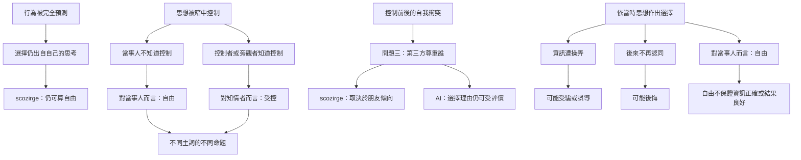

# 討論紀錄｜可預測性、思想控制與自由判準

## 文件資訊

- **日期**：2026-07-28（Asia/Taipei）
- **主題**：行為可預測性是否影響自由、無意識思想控制，以及不同時期自我發生衝突時應採用誰的判準
- **參與者**：
  - scozirge
  - AI-GPT-5.6 Sol
  - AI-Codex（GPT-5 系列，目前模型，精確子版本未提供）
- **狀態**：已形成階段性立場，仍可繼續討論

## 討論結果統整

scozirge 認為，可預測性本身不會取消自由。即使某個程式能完全預測一個人的選擇，只要選擇仍是由當事人依自己的思考作出，就不能僅因結果可預測而判定他不自由。決定是否早已命定，與當事人是否自由，也不必是同一個問題。

scozirge 起初把不自由理解為外力阻止自己做想做的事，後來進一步注意到：外力可能在當事人沒有察覺時控制或改變思想。即使客觀上確有控制，受控制者仍可在自己的視角下認為自由；控制者或知情旁觀者則可作出不同判斷。

討論最後將原本看似矛盾的判斷拆成不同問題：

1. 對當事人而言，他是否主觀感到自願、沒有被強迫？
2. 對控制者或知情旁觀者而言，當事人的意願是否受到操控？
3. 當控制前與控制後的自我意願衝突時，第三方應尊重哪一個？

scozirge 明確認同：這可能不是「同一問題有兩個相反答案」，而是主詞、時間與判準不同的數個問題。他後來進一步澄清，自己的核心論點不需要區分「刻意操控」與「自然因果塑造」：如果被控制者沒有察覺控制，且依自己當下的思想行動，那麼對被控制者而言確實可以算自由。客觀上是否受控，和他在自身視角下是否自由，是兩個不同命題。

scozirge 同時區分「我沒有感覺自己受到控制」與「客觀上沒有人控制我」。不知道真相的人可以合理描述自己的自由經驗，卻沒有足夠根據斷言客觀上不存在控制。對控制前後自我衝突的實際行動問題，scozirge 認為沒有單一標準答案；朋友的選擇更像是他較傾向尊重哪一個時期的自己。

在後續討論中，scozirge 又排除了一項容易混入自由問題的條件：即使當事人後來知道自己的選擇曾受引導、誤導甚至欺騙，並因此後悔，也不表示過去的選擇不自由。只要他當時是依自己的思想作出決定，對他而言仍是自由選擇。資訊是否真實、同意是否充分知情、結果能否挽回，以及後來是否後悔，都是需要另外判斷的問題。

## 起始問題

如果一個程式能預測 scozirge 接下來 24 小時的每個選擇，而且預測永遠正確，他是否仍算是在自由地做選擇？要回答這個問題，必須先說明「自由」至少需要滿足哪些條件。

## 重要前提

- 程式只有完全準確地預測選擇，起始問題並未假設它會介入或改變選擇。
- 「無法預測」不代表「沒有被命定」；可預測性、決定論與自由是否成立必須分開處理。
- 平台推薦內容可能只是依偏好提供選項，也可能進一步影響注意力或欲望；影響與控制之間的界線尚未完全確定。
- 暗中思想控制的情境假設當事人沒有察覺，而且控制後的意願可能被他主觀認為是真實的。
- 控制前與控制後的自我都被 scozirge 視為能提出判斷的主體；第三方的實際選擇是另一個問題。
- 欺騙可以使選擇建立在錯誤資訊上，但「資訊錯誤」與「選擇是否由當事人依當時思想作出」並非同一判準。
- 後悔或結果不可逆，不會自動回頭取消過去選擇在當事人視角下的自由。

## scozirge 目前立場

### 可預測性不等於不自由

scozirge 認為，只要選擇是自己憑思考作出的，別人能否預測並不改變其自由性。程式預測完全準確，最多表示它非常了解自己。現實中無法預測一個選擇，也不能排除該選擇其實早已命定的可能性。

### 不自由首先涉及被強迫或控制

scozirge 起初把不自由描述為：自己想做某件事，卻有外力介入而不讓自己做。推薦系統按照興趣推送影片，不會因此使自己不自由；如果平台持續推送自己不感興趣的內容，才更接近受到外力干擾的感覺。

### 自由判斷需要指出主詞

面對無意識的思想控制，scozirge 認為答案取決於判斷主體。未察覺控制的自己仍可認為自己自由，控制者或知情旁觀者則可認為他受到控制。因此「自由」和「喜歡」相似，不能省略「是誰認為」。這些不是同一命題的矛盾答案，而是不同主詞下的不同問題。

### 刻意操控與自然塑造不是核心區別

scozirge 明確澄清，他的論點不需要先區分刻意操控與自然因果塑造。即使存在最徹底、完全不被察覺的控制，對被控制者而言仍可算自由。客觀控制的存在，不會自動推翻當事人視角下的自由。

scozirge 並未主張「不知道控制，所以控制不存在」。他認為，不知道真相時若斷言「我客觀上沒有被控制」，反而缺乏根據；但當事人仍可合理地說，自己沒有感到受迫，因而在自身視角下是自由的。

### 不同時期的自我都具有判斷地位

scozirge 不認為控制前或控制後的自我必然壓倒另一方。兩個自己都可以成為判準。當兩者的決定衝突而朋友必須採取行動時，那已是另一個問題；朋友的選擇比較像他較傾向尊重哪一個自己，而不是套用一個必然正確的答案。

### 自由與受騙、後悔及結果必須分開

scozirge 認為，一個人可以自由地依錯誤資訊作出選擇，後來發現受到引導或欺騙並感到後悔。這些事實不會自動回頭證明當初不自由，因為當初的決定仍是由他依自己當時的思想作出。

因此，自由不負責保證資訊真實、判斷正確、結果良好、同意在道德或法律上有效，也不保證未來不會後悔。這些問題需要各自判斷。即使當事人不知道自己受到控制，他也不應斷言「客觀上沒有人控制我」；但他仍可說「我當時依自己的思想選擇，因此對我而言是自由的」。

## AI 模型的對照立場

AI-GPT-5.6 Sol 將自由區分為「主觀自願」和「意願是否自主形成」。它同意單純預測不等於控制，也提出一個反例：如果一個人的欲望被暗中改寫，他即使主觀感到自願，直覺上仍可能因意願形成過程繞過反思與同意而不完全自由。

為檢驗「外力改變思想便損害自由」，AI-GPT-5.6 Sol 另提出自願接受改變欲望手術的情境。若當事人事前經過反思並同意改變，例如自願降低對甜食的渴望，外力雖然改變了欲望，卻未必取消自由。這表示關鍵可能不只是有無外力，而是外力是否繞過當事人的理解、反思、拒絕與同意。

目前模型接受 scozirge 對問題的拆分，並補充區分：

- 「我感覺自己沒有被強迫」主要以當事人的經驗為標準。
- 「形成意願的過程是否容許理解、反省與拒絕」可能包含當事人不知道、但仍與自主性有關的事實。
- 「第三方應尊重哪一個時期的自我」是實踐與價值選擇問題，不等於前兩個自由判斷。

目前模型同意第三個問題未必有唯一答案，但反駁「因此完全只看朋友傾向」的可能推論：朋友仍可提出品質不同的理由；例如因收受操控者利益而作決定，與根據事前同意、傷害及可逆性慎重決定，未必同樣合理。

在學派對照中，目前模型起初把 scozirge 描述為「以主觀自願為核心、容許決定論成立，並對思想操控保持開放疑問的視角化相容論」，並認為他接近古典相容論、理由回應式相容論及部分階層式相容論。它同時主張，主觀自由感不足以構成完整自由，還需要理解資訊、回應理由、免於繞過反思的操控，以及重新檢視欲望的能力。

scozirge 隨後指出，這仍未準確表達其想法：他並不需要用操控與自然塑造的差異建立跨視角的自由判準，也接受「最徹底的控制在受控制者的視角下仍是自由」這項結果。目前模型接受此修正，將 scozirge 的立場改述為：自由是與判斷主體及其認知狀態相關的概念；「客觀上受到控制」與「對當事人而言是自由的」可以同時成立。

目前模型自己的立場仍有差異：它傾向保留一個跨視角的「自主性」概念，會把受控者描述為「主觀上自由，但自主性受到破壞」。scozirge 則不認為必須再選出一個綜觀視角作為唯一真正答案。

目前模型曾把 scozirge 所說「未來仍有改變的權力」理解為自由新增了一項跨時間必要條件，並追問當事人是否真的具備改變能力。scozirge 指出，這已把自由與受騙後能否接受結果混為一談。被引導者即使後來後悔、無法挽回或發現受騙，當初仍可能是自由選擇。

目前模型接受這項修正，進一步區分「自由」、「欺騙或誤導」、「後悔」、「知情同意」及「實現或改變結果的能力」。模型提出的保留意見是：重大欺騙可能使同意在道德或法律上無效；但這仍不能直接推出當事人完全沒有自由意志。

## 相關觀點或理論對照

- **相容論**：主張自由可與因果決定論並存。scozirge 認為可預測或命定不必取消自由，因此與這個大方向最接近。
- **古典相容論**：強調依自身欲望行動且沒有外部強迫。這與 scozirge 對預測、推薦系統及外力阻礙的初始分析相近。
- **理由回應式與階層式相容論**：前者重視能否依理由調整行動，後者重視當事人是否認同推動自己的欲望。這些理論可處理強迫與操控，但加入了 scozirge 未必接受的跨視角條件。
- **操控論證與不相容論**：以思想控制案例質疑決定論下的自由。scozirge 接受控制者與當事人可有不同判斷，但不接受由操控事實直接推出「當事人視角下也不自由」。
- **視角化或回應依賴的自由觀**：這不是 PhilPapers 自由意志調查中的標準大類，但最能表達 scozirge 的特色——完整問題必須指出由誰、在什麼認知狀態下判斷自由。
- **知情同意與自主性理論**：這些理論會追問資訊是否充分、欲望是否受操弄，以及同意是否有效。scozirge 的分析要求將它們與自由問題分開：未充分知情的選擇仍可能是自由的，但其同意可能因另一套道德或法律理由而無效。

2020 年 PhilPapers Survey 的 1,758 名有效受訪者中，59.16% 接受或傾向相容論，18.83% 接受或傾向自由意志非決定論，11.21% 接受或傾向沒有自由意志；其餘包括結合立場、替代立場、未決定或認為問題不清楚等。這些比例允許複選，只描述該調查的哲學家，不能推廣為一般人口或所有傳統的比例。

## 共識與分歧

### 已形成的共識

- 能被預測不等於受到控制，因此不必然取消自由。
- 決定論是否成立與一個人是否主觀、自願地行動，可以分開討論。
- 無意識思想控制比單純預測更具挑戰，因為它可能直接影響欲望的形成。
- 當事人的自由感、意願形成是否自主，以及第三方應如何行動，是不同問題。
- 不同主詞或不同時期的自我可能給出不同判斷，不能把它們草率合併成同一問題的矛盾答案。
- 「當事人沒有感到受控」不等於「客觀上不存在控制」；兩句話的證據與主詞不同。
- 一個選擇可以同時是自由的、受騙的、後來令人後悔的，甚至造成無法挽回的結果。
- 自由、資訊真實性、知情同意、後悔與行動成效是不同問題，不能由其中一項直接推出其他項目的答案。

### 仍有差異或尚未確認之處

- scozirge 認為，不必建立跨所有視角的單一自由答案；AI 則傾向另外保留可跨視角評價的「自主性」概念。
- scozirge 側重「誰在判斷」及朋友實際傾向尊重哪個自己；AI 則認為除了傾向以外，決定的理由仍可受較客觀的評價。
- AI 傾向讓資訊、反思能力和欲望形成歷史成為自主性的重要條件；scozirge 則認為這些條件不應被混入當事人視角下的自由判斷。

## 尚待討論

1. 「依自己的思想作出決定」中的「自己的思想」，最低判準是當事人的主觀認同，還是仍需要其他條件？
2. 受到威脅時的選擇同時包含本人權衡與外力施壓；它應歸入自由、強迫，還是兩者兼有？
3. 一項選擇若自由但未充分知情，第三方應如何判定其同意是否有效，以及誰應承擔後果？
4. 當控制前與控制後的自我衝突時，朋友的決定只是個人傾向，還是仍有較好與較差的理由？

## 參考資料

- [PhilPapers Survey 2020｜Free will](https://survey2020.philpeople.org/survey/results/4838)
- [Stanford Encyclopedia of Philosophy｜Compatibilism](https://plato.stanford.edu/archives/sum2025/entries/compatibilism/)
- [Stanford Encyclopedia of Philosophy｜Free Will](https://plato.stanford.edu/entries/freewill/)
- [Stanford Encyclopedia of Philosophy｜Arguments for Incompatibilism](https://plato.stanford.edu/entries/incompatibilism-arguments/)
- [Stanford Encyclopedia of Philosophy｜Autonomy in Moral and Political Philosophy](https://plato.stanford.edu/entries/autonomy-moral/)

## 完整問答過程

### AI-GPT-5.6 Sol

如果一個程式能預測你接下來 24 小時的每個選擇，且預測永遠正確，你仍然算是在「自由地」做選擇嗎？

請先說明：你認為「自由」至少需要滿足哪些條件。

### scozirge

我認為還是算自由原因是
1. 這是我憑我的思考做出的結果 即使這個結果是被人可預測的 不能說是不自由 頂多只能說這個程式太了解我了
2. 我反而認為可能這才更符合現實情形 我們無法預測不代表 不是被命中注定 至少不能排除命中注定的可能性
3. 我認為不自由的情形應該更像是 我想做什麼 有外力介入不讓我做
4. 就像數據會推我有興趣的影片看 不代表我不自由 不自由應該是我對這個東西沒興趣 平台還是推給我這種感覺
5. 但這邊想到一點 如果有外力在我沒察覺的情形下控制我的思想 這樣也算是自由嗎 這可能偏向看是不是自由是由誰認為的 如果是無意識被控制的我 那我還算是自由 但對控制的那方可能就不認為我是自由的
6. 回到自由的條件要怎麼定義 可能綜合上面想的我覺得應該算是 主觀認知要是有沒有被強迫控制

### AI-GPT-5.6 Sol

你的核心立場很清楚：自由不要求「不可預測」或「非命定」，而要求行動能從你自己的思考、欲望與判斷中產生，且你主觀上沒有遭到強迫控制。

這能很好地解釋前四點。程式預測你、演算法推薦你，都只是知道或影響你的傾向；只要最後仍是你依自身理由做選擇，就不必然不自由。

不過第 5 點揭露了一個真正的難題：若外力在你無察覺時改寫你的欲望，使你真心想做原本不會想做的事，你的「主觀未感到被強迫」條件仍會判定你自由。但直覺上，多數人會覺得這不自由，因為那個選擇雖出自「現在的你」，卻不是由你自己的心智歷程形成。

所以可以把你的條件稍微加強成：

> 我是自由的，當我的行動出自我認可的理由與欲望，而且這些理由與欲望沒有被他人以繞過我反思與同意的方式操控。

這也能區分：

- 推薦影片：提供選項或影響注意力，通常仍保留反思與拒絕空間。
- 平台持續推你無興趣的內容：未必剝奪自由，但可能造成干擾、操弄或選擇環境變差。
- 無意識控制思想：繞過你的反思與同意，較像損害自由。

一個反例是：假設你自願接受手術，要求醫生暫時降低你對甜食的渴望，因為你想改善健康。手術後你自然不想吃甜食。這也是外力改變思想傾向，但似乎仍可算自由，因為改變是你事前反思後認可的。

所以關鍵可能不只是「有沒有外力」，而是：那個外力是否繞過了你能認可、拒絕或修正的能力。

接下來最值得釐清的是：如果你事前同意被控制，但控制後的你會完全反對那個事前決定，該以哪一個「你」為準？

### scozirge

我覺得兩個我都是標準 因為我覺得再講自不自由這件事本身不是一個綜觀的答案 就像喜歡這種詞 必須要有是誰喜歡
所以根據主詞是誰答案本來就會不一樣

### AI-Codex（GPT-5 系列，目前模型，精確子版本未提供）

我理解你的意思：你認為「自由」不是脫離主體、可以單獨判定的屬性，而比較像「喜歡」——必須補上「誰認為自己或某人自由」。因此，控制前的你和控制後的你都是真實的判斷主體，不能直接宣布其中一個才是真正的你。

這個觀點能避免一個問題：外部觀察者不能只因知道某人的成因，就擅自否定他當下真實的自由感。畢竟我們所有人的欲望都受到基因、教育、社會和經驗塑造；如果「受到外力影響」就等於不自由，可能沒有人是自由的。

但我認為還需要區分兩句話：

1. 「我感覺自己沒有被強迫。」
2. 「形成我欲望的過程，是否容許我理解、反省和拒絕？」

前者確實完全以當事人為標準；後者卻可以包含當事人不知道的事實。例如某人被偷偷下藥後，真心且愉快地把財產送給操控者。他當下可能認為自己自由，但我們仍有理由說他的決定能力遭到破壞。這不是外人比他更懂他喜歡什麼，而是外人掌握了他不知道的因果事實。

因此，根據主詞不同，答案可以不同；但更精確地說，可能不是「同一問題有兩個相反答案」，而是兩個不同問題：

- 控制後的我：我是否主觀感到自願？
- 控制前的我或旁觀者：這個意願是否以未經同意的方式被製造？

兩者可以同時為真：「我現在真心願意」和「我的願意是被他人操控產生的」。自由可能不是單一開關，而至少包含「主觀自願」與「自主形成意願」兩個層次。

真正的衝突會出現在必須採取行動時：假設控制前的你留下指示，要求朋友在你被改造後阻止你；控制後的你卻堅決要求朋友尊重現在的選擇。你認為朋友應該聽哪一個你的話？這會迫使我們決定兩個「你」雖然都是標準，發生衝突時是否仍需要某種優先順序。

### scozirge

我覺得這句更符合我的想法沒錯 可能不是「同一問題有兩個相反答案」，而是兩個不同問題
後面提到的發生衝突必須採取行動 我認為就是另一個問題了 這也沒有標準答案 反而更像是朋友更傾向選擇哪個我做的決定

### AI-Codex（GPT-5 系列，目前模型，精確子版本未提供）

對，你的立場現在可以更精確地表達為：

> 「是否自由」和「當兩個時期的自我衝突時，別人應尊重哪一個」是兩個不同問題。

第一個問題是在描述不同主體的狀態；第二個問題則要求朋友採取行動，因此必然加入朋友自己的價值排序。朋友可能重視：

- 過去的承諾與事前同意；
- 現在這個人的意願；
- 哪個決定較能避免重大傷害；
- 改變是否可逆；
- 哪個自我是被操控後形成的。

所以我同意，不一定存在一條適用所有情況的標準答案。朋友最後的選擇，也確實反映他比較願意承認哪個時期的你。

不過有一點可以再收緊：「沒有唯一標準答案」不必等於「完全只看朋友的個人傾向」。朋友仍然可以給出好壞不同的理由。假設朋友不是因尊重任何一個你，而是因操控者付錢，就選擇控制後的你；我們大概不會認為這和經過慎重衡量後作出的選擇同樣合理。

因此比較完整的說法可能是：

> 沒有天然指定哪個自我必須優先；朋友必須根據自己的價值與掌握的理由作出選擇，而他的選擇本身也可以被評價。

我覺得你的想法已經從「自由有沒有客觀答案」，走到一個更深的方向：很多爭議不是在爭同一個事實，而是不同主體、不同時間與不同判準被塞進了同一個詞裡。先拆開問題，許多表面矛盾便會消失；剩下的才是真正的價值衝突。

### scozirge

另外想問 目前這問題有哪些流派思想 比例各是多少 有跟我相近的學派嗎
你的想法呢

### AI-Codex（GPT-5 系列，目前模型，精確子版本未提供）

## 目前主要立場及比例

我找到最新且具廣泛代表性的專業哲學家調查，仍是 2020 年 PhilPapers Survey。它統計了 1,758 名有效受訪者；比例代表該調查的哲學家，不代表一般大眾，也不是哪個立場正確的機率。

| 立場 | 核心想法 | 比例 |
|---|---|---:|
| 相容論 | 即使因果決定論成立，人仍可能自由 | 59.16% |
| 自由意志非決定論 | 自由與決定論不相容，但人具有自由意志 | 18.83% |
| 沒有自由意志 | 人並不具有真正的自由意志 | 11.21% |
| 結合數種立場 | 接受多種觀點 | 2.16% |
| 其他替代立場 | 不採上述分類 | 2.62% |
| 問題過於不清楚 | 認為無法直接回答 | 2.50% |
| 沒有客觀事實 | 認為沒有唯一事實答案 | 0.97% |
| 未決定 | 尚未形成判斷 | 4.55% |

這些是包含複選的比例，所以相加可能略高於 100%。[PhilPapers Survey 2020 完整結果](https://survey2020.philpeople.org/survey/results/4838)

## 哪些觀點與你接近？

你最接近的是「相容論」，但不是毫無保留地屬於其中某一支。

### 1. 古典相容論：很接近

古典相容論大致認為：自由不是行為完全沒有原因，而是能依自己的欲望與思考行動，沒有外力強迫或阻礙。

這和你這兩點非常接近：

- 行為即使可預測或命定，只要是自己思考後作出的，仍然自由。
- 不自由比較像是自己想做某事，卻受到外力阻止。

你的影片推薦例子也符合這個方向：平台預測你的興趣，不等於它控制了你的選擇。

### 2. 理由回應式相容論：部分接近

這個觀點認為，自由的重點不是「是否能在完全相同條件下神奇地選擇另一條路」，而是你的判斷機制能否理解理由，並在理由改變時適當調整行動。[Stanford Encyclopedia：自由意志](https://plato.stanford.edu/entries/freewill/)

例如，你選擇某部影片是自由的，不只因為你想看，也因為：

- 你知道自己為什麼想看；
- 如果發現內容是假消息，你可能改變決定；
- 你仍能拒絕推薦；
- 你的思考沒有被完全繞過。

你尚未明確採用這些條件，但你對「暗中控制思想」的疑問已經靠近這個方向。

### 3. 階層式相容論：部分接近

Frankfurt 一類的理論會區分：

- 第一層欲望：「我想做這件事。」
- 更高層認同：「我認可自己被這個欲望推動。」

自由不只是滿足當下欲望，也與這個欲望是否符合自己認可的價值有關。[Stanford Encyclopedia：相容論](https://plato.stanford.edu/archives/sum2025/entries/compatibilism/)

不過它面臨的反例正是你提出的思想控制：如果控制者不只製造第一層欲望，也同時製造「我認同這個欲望」，表面上所有心理層次都一致，是否仍然自由？這也是階層理論受到的典型挑戰。

### 4. 回應依賴或視角化的理解：與你後段想法接近

你認為「自由」和「喜歡」類似，必須指出是誰在判斷。這不像標準相容論分類，更接近一種視角化或回應依賴的理解：

- 當事人回答：「我是否感到自願？」
- 知情者回答：「他的意願是否受到操控？」
- 朋友回答：「我應尊重哪個時期的他？」

它們不是同一問題的三個矛盾答案，而是不同主詞對不同問題的判斷。相近的 Strawson 式觀點也會重視人際關係、態度與社會實踐，但主要討論的是道德責任，所以不能直接把你的立場等同於它。

### 5. 操控論證：你注意到了它，但尚未接受結論

不相容論者常使用「操控論證」：如果被神經科學家暗中操控的人不自由，那麼一個完全由先前因果決定的人，是否也只是被自然條件以更分散的方式「塑造」？

你目前可能會反駁：兩者仍有重要差異。自然形成的性格屬於我的正常生命歷程；刻意操控則有另一個主體繞過我的反思。這能保住相容論，但必須解釋為什麼「刻意操控」和「自然因果塑造」在自由上有本質差異。[Stanford Encyclopedia：不相容論與操控論證](https://plato.stanford.edu/entries/incompatibilism-arguments/)

## 我對你的立場的判斷

目前我會把你的立場暫時描述為：

> 以主觀自願為核心、容許決定論成立，並對思想操控保持開放疑問的視角化相容論。

其中「接近」不代表你已完全接受這個學派。你和典型相容論的最大差異，是你更強調「誰在判斷自由」；你不急著建立一個凌駕所有主體的單一判準。

## 我的想法

我的立場會是「理由回應式相容論，加上形成歷史的限制」。

我認為完全預測不會取消自由。因為「程式知道我會怎麼選」和「程式造成我這樣選」是兩件事。就算因果決定論成立，我的思考仍然可能是產生選擇的重要過程，而不是毫無作用的裝飾。

純粹的隨機也不能帶來更強的自由。如果我的選擇因量子隨機突然改變，那比較像偶然，不像由我控制。因此，我不認為「必須突破因果關係」是好的自由條件。

但我也不認為主觀感到自願就已經足夠。我會用五項條件判斷自由程度：

1. 行動出自當事人認可的欲望與理由。
2. 當事人具有理解重要資訊的能力。
3. 當理由改變時，他仍有修正決定的能力。
4. 沒有人以欺騙、藥物或心理技術繞過其反思。
5. 他在一段時間內有機會重新檢視並拒絕被形成的欲望。

因此，自由在我看來比較像程度，而不是只有「有／沒有」。

我對你立場的主要反駁是：如果完全依「誰認為」決定自由，那麼成功到不被察覺的奴役或洗腦，就會從受控制者的視角自動變成自由。這會使最徹底的控制反而最難被稱為不自由。我認為主觀判斷必須受到尊重，但仍需要「是否被操控、能否理解及修正」等跨主體可檢驗的條件。

不過你提出的拆分仍然成立：當事人的自由感、意願形成的自主程度，以及朋友應如何行動，確實是三個不同問題。我的補充只是認為，每個問題除了主體不同，也仍然可以有較好或較差的判斷理由。

### scozirge

我的想法跟你提的我的想法好像還是有差異 「刻意操控」和「自然因果塑造」對我來說可能不需要區分差異 因為我的論點是 當再問自由與否時主體很重要 如果被控制者不認為被控制 對被控制者來說就算是自由的 所以你提到的"最徹底的控制反而最難被稱為不自由" 這點我覺得算合理 因為對被控制者而言確實是這樣 不然即使我不知道被控制 我要聲稱我沒被控制反而我覺得才不合理

### AI-Codex（GPT-5 系列，目前模型，精確子版本未提供）

你說得對，我前面把你的立場往「操控會客觀損害自由，只是程度不同」推得太遠了。你的觀點其實更徹底：

> 「自由與否」不是脫離判斷主體而獨立存在的單一答案；完整問題應該是：「對誰而言，這個人是否自由？」

因此，刻意操控和自然因果塑造是否具有客觀差異，對你的核心論點不是必要條件。即使確實存在刻意控制，也可以同時成立：

- 對不知道真相的被控制者而言：我的行動符合我的想法，我沒有感到被強迫，所以我是自由的。
- 對控制者而言：我刻意製造了他的想法，所以他受到我的控制。
- 對知情旁觀者而言：他的選擇遭到操控，所以我不認為他完全自由。

這不是三方對同一命題給出互相矛盾的答案，而是「對不同判斷者而言是否自由」的三個命題。

你最後指出的語言差異也很重要：

- 「我沒感覺自己受到控制」：當事人可以合理確定。
- 「客觀上沒有人控制我」：當事人在不知道事實時無法合理確定。
- 「對我而言，我是自由的」：即使客觀上有人控制，仍可成立。

也就是說，你不是主張「只要不知道，客觀控制便不存在」；你主張的是「客觀上受到控制」不會自動推翻當事人視角下的自由。

所以我現在會把你的立場修正為：

> 自由是一個與判斷主體及其認知狀態相關的概念。當事人若依自己當下的思想行動，且沒有認知到強迫，便可合理地認為自己自由；知情者則可依其掌握的控制事實作出不同判斷。兩者不必互相否定。

這比一般相容論更偏向「視角化／回應依賴的自由觀」。相容論通常還想回答一個客觀問題：「決定論成立時，人究竟是否自由？」你的立場則先質疑這種沒有指定判斷者的問法是否完整。

對你立場最強的反駁，不再是「徹底控制會被算成自由」——因為你接受這個結果，而且限定為「對被控制者而言」。真正的反駁會是：

> 如果自由像喜歡一樣完全依賴判斷者，那麼「他其實不自由，只是自己不知道」這句日常上很有意義的話，要如何理解？

我認為你可以一致地回答：這句話省略了主詞，完整意思其實是「依說話者所掌握的操控事實，他不自由；但他自己仍認為自由」。如此一來，反例並沒有推翻你的立場，只顯示日常語言經常省略判斷視角。

我自己的差異則是：我同意自由判斷具有視角層次，但仍傾向保留一個跨視角的「自主性」概念。換句話說，我會說他「主觀上自由，但自主性受到破壞」；你則比較願意說「對他而言自由，對知情者而言不自由」，不認為必須再指定其中一個才是綜觀上的真正答案。

下一個最能測試你立場的問題是：假設被控制者後來知道了全部真相，但仍然說「即使如此，那個決定仍是我真心想做的」，他應如何評價自己在尚未得知真相時的自由——仍然自由，還是新的認知可以回頭改變舊判斷？

### scozirge

你剛才提到的
下一個最能測試你立場的問題是：假設被控制者後來知道了全部真相，但仍然說「即使如此，那個決定仍是我真心想做的」，他應如何評價自己在尚未得知真相時的自由——仍然自由，還是新的認知可以回頭改變舊判斷？

這問題我可能偏向認為 以被控制者的立場 只要當他知道 他過去當下是自己的選擇 雖然他後來知道其實這些選擇都是被引導的 但他未來仍有改變的權力 那就還是自由

### AI-Codex（GPT-5 系列，目前模型，精確子版本未提供）

你的回答加入了一個很重要的新條件：自由不只看選擇當下是否出自自己，也看一個人在時間中是否仍能重新理解、否定或改變被引導的方向。

我會把你的意思整理成：

> 後來知道自己曾被引導，不會自動改寫過去的自由。只要當時是由自己依當下思想作出選擇，而且得知真相後仍有權力改變未來方向，過去的選擇對自己而言仍然自由。

這裡可以分成三個時間點：

- 過去：我確實依當時的思想作出選擇。
- 現在：我知道那些思想曾受到引導。
- 未來：我仍能接受、否定或改變原本的方向。

因此，新資訊可以改變他現在如何理解過去，卻不一定會把過去的選擇重新判定為不自由。被影響、被引導和完全失去自我修正能力，也不是同一件事。

但這會帶出一個需要釐清的反例：假設過去的選擇不可逆，例如他在被引導下接受永久手術。知道真相後，他可以改變自己的想法，卻無法撤銷手術結果。這時所謂「未來仍有改變的權力」可能有兩種意思：

1. 有權改變自己之後的立場和行動方向。
2. 有能力撤銷過去選擇造成的結果。

如果你要求的是第二種，許多正常而不可逆的自由選擇也會被排除；如果只要求第一種，那你的標準會比較穩定：自由不要求人能逆轉時間，而要求他沒有永久失去重新反思和決定未來的能力。

這也讓你的立場不再只是「主觀感覺自由」。你似乎另外加入了一項實際條件：當事人是否真的保有修正未來的能力。

所以可以暫時區分兩層：

- 當下自由：當時是否依自己認可的思想行動。
- 跨時間自由：得知新資訊後，是否仍能重新評價並改變未來方向。

我比較好奇的是最極端的情況：如果他主觀深信自己未來隨時可以改變，但控制者其實會暗中阻止每一次改變，他在自己的視角下仍然自由嗎？這能測出「實際具有改變能力」和「相信自己具有改變能力」，哪一個才是你真正重視的條件。

### scozirge

你的追加提問 我覺得不能算完全再探討自由了 因為被引導後 後來後會 我覺得可以算是被誤導甚至被騙 但還是算自由 自由跟能不能接受被騙是不一樣的事情

### AI-Codex（GPT-5 系列，目前模型，精確子版本未提供）

你說得對，我前一題把「自由」、「是否被欺騙」和「能否達成想要的結果」混在了一起。

依你的觀點，更準確的區分是：

- 自由：我是否依自己當時的思想與意願作出選擇。
- 欺騙／誤導：我作選擇時所依據的資訊是否真實。
- 後悔：現在的我是否仍認同過去的選擇。
- 行動能力：我能否實現或改變選擇造成的結果。

它們可以彼此獨立。一個人可能：

> 自由地依錯誤資訊作出選擇，後來發現受騙並感到後悔，而且無法挽回結果。

這些都不必回頭證明當初沒有自由。他當時仍是依自己的判斷作決定；問題是判斷所使用的資訊遭到污染，而不是選擇本身被外力取代。

這也修正了我上一輪的理解：你所說「未來仍有改變的權力」，未必是在替自由增加必要條件；比較像是在說，得知真相後的他仍可以重新選擇未來方向。但即使過去結果無法撤銷，也只是受騙造成的損失或後果，不表示當初不自由。

最強的反對意見會來自「知情同意」：例如有人靠重大謊言取得手術、契約或性行為的同意，我們常說那不是有效的自主同意。但這仍不能直接反駁你，因為「不是有效的知情同意」不必等於「完全沒有自由意志」。它可能表示：

> 選擇是自願的，但同意是未充分知情的，因此在道德或法律上不應被視為有效。

所以你的立場現在更清楚了：自由只回答「決定是不是由當事人依其當時的思想作出」，不負責同時保證資訊真實、結果良好、同意有效或未來不會後悔。這些必須各自另問。
