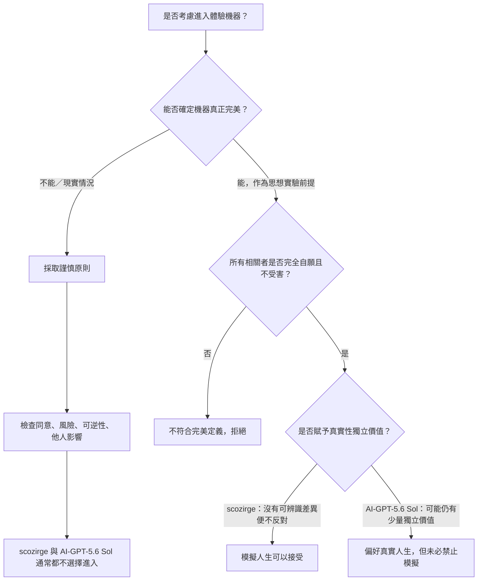

# 哲學討論紀錄｜完美體驗機器、真實性與人生價值

> 日期：2026-07-28（Asia/Taipei）  
> 檔案主題：完美體驗機器－真實性與人生價值  
> 哲學主題：體驗機器、人生價值、人格同一性、真實性  
> 參與者：scozirge、AI-GPT-5.6 Sol  
> 狀態：階段性統整，可在未來討論後繼續更新  
> 紀錄方式：開頭先提供討論結果統整與摘要，最後完整保留雙方問答。存檔與文件格式等後設對話不列入。

## 一、討論結果統整與摘要

這次討論從「是否願意進入一台提供完美人生的體驗機器」開始，最後釐清：雙方原先看似明顯的分歧，很大一部分來自討論了不同層次的問題。

- scozirge 主要討論的是一台在定義上真正完美的機器：完全自願、沒有故障、沒有隱藏受害者、不會破壞他人的生活，也能滿足完整生命歷程中的需求。
- AI-GPT-5.6 Sol 經常考慮的是現實中有人宣稱機器完美的情況：技術可能失敗、資訊可能錯誤、同意可能不完整，也可能出現不可逆的傷害。
- 在真正完美的理想條件下，scozirge 願意接受模擬人生，甚至接受自願的人格改造；因為除了「現實／機器」這個標籤外，沒有其他可辨識或會造成後果的差異。
- 在現實條件下，scozirge 通常不會選擇機器，並且和 AI-GPT-5.6 Sol 一樣重視知情同意、權利、風險、可逆性及對所有相關者的影響。
- 剩餘的主要差異是：真實性、真實關係與人格延續是否即使不造成任何經驗差異，仍具有少量獨立價值。

最終共識可以濃縮為：

> 在真正完美、完全自願且無人受害的理想條件下，模擬人生未必比真實人生低等；但在不完美的現實世界中，不能用這個思想實驗替高風險、不可逆或未經同意的技術背書。

### 理想條件與現實決策圖

## 二、思想實驗中的「完美」前提

本次討論中的完美機器，不只是讓人持續感到愉快，而是符合以下條件：

- 理想人生可以包含痛苦、平靜、失敗、挑戰、成長及真正困難的選擇。
- 人生具有足夠的未知與探索；進入者不會預先知道劇情。
- 機器不會故障，也沒有被迫醒來或意外識破模擬的風險。
- 進入後，不會保留足以破壞投入感的「這是模擬」認知。
- 它能滿足完整生命歷程中的需求，而不只是讓最後一刻感到快樂。
- 所有受影響的人都自願；不存在未經同意的人格或記憶改造。
- 進入者的離開不會讓親友承受不願承受的失落，也不會產生隱藏的受害者或負面外部影響。
- 若人格被改造，現在的本人自願接受，改造後的人也真實滿足。

這組前提非常強，已經將技術失敗、強迫、欺騙、未經同意與他人受害等多數現實倫理問題排除。思想實驗最後主要測試的不是安全性，而是「真實性本身是否具有獨立價值」。

## 三、scozirge 目前的立場

可以暫時統整為：

> 人生價值主要落在所有相關者完整的意識經驗上。快樂、痛苦、未知、趣味與多樣性都應納入整段歷程考量。固定人格與不可經驗的真實性差異不具有必然的獨立價值；但現實中的同意、風險、他人影響與不可逆性仍然非常重要。

### 對人生價值的看法

- 完美不等於永遠快樂；有痛苦、挑戰與未知的人生也可以是理想人生。
- 過程中的快樂與不快樂都重要，不能只看生命最後的狀態。
- 痛苦可能帶來對比、成就感與多樣性，但不是人生意義的必要門票。
- 有痛苦而豐富的人生，以及完全沒有痛苦但永不空洞的幸福人生，都可以接受；scozirge 只是因為多樣性與趣味而偏好前者。

### 對真實與模擬的看法

- 不主張模擬在形上學上等於現實。
- 若現實與模擬之間除了標籤外，沒有任何可辨識、可經驗或會造成後果的差異，就沒有理由只為標籤反對機器人生。
- 現在所認為的真實人生本身也可能是無法識破的模擬；因此，無法驗證的底層標籤不應自動取消已經歷過的愛、痛苦與成長。

### 對人格改造的看法

- 保存現在的人格不是絕對義務。
- 如果現在的本人自願、改造後的人真實滿足，且所有相關者都知情、自願並不受害，核心價值被改寫仍可以接受。
- 自我可以被改變，但不能藉此單方面取消與他人的關係和責任。

### 理想條件與現實條件

- **理想條件下**：偏向質性或多元體驗主義；完美模擬可以與真實人生同樣值得選擇。
- **現實條件下**：不會輕信任何人或機構宣稱機器完美；通常不會選擇進入，並重視同意、權利、可逆性與風險控制。

## 四、AI-GPT-5.6 Sol 的立場及雙方差異

AI-GPT-5.6 Sol 偏好以規則結果論為核心，加入權利保障、價值多元與道德可錯論的混合立場：

- 必須考慮行動和制度實際造成的幸福、痛苦、自由與長期風險。
- 以誠信、同意、公平及隱私等規則防止個人被當成幸福計算的材料。
- 承認面對 AI、人格改造與數位生命時可能判斷錯誤，因此偏好可逆、可檢查、可修正的方案。
- 同意、真實關係與自主有時可能在沒有人感到受害時仍具有一定的獨立價值。

雙方原先的可能分歧是：

> 一個人是否可能在永遠不知情、也永遠不痛苦的情況下，仍然受到傷害或不公正對待？

經過澄清後，雙方在現實世界的判斷高度重疊。主要剩餘差異是：

- scozirge 認為無法經驗、無法辨識、也不會造成任何後果的真實性差異，沒有理由被賦予足以反對機器人生的價值。
- AI-GPT-5.6 Sol 仍可能偏好真實關係與獨立存在的他人，認為它們或許具有少量非體驗性的價值，但未必因此主張禁止進入完美機器。

## 五、與哲學學派的關係

沒有單一學派能完全涵蓋 scozirge 的立場，比較接近以下組合：

| 面向 | 接近的立場 | 保留與差異 |
|---|---|---|
| 人生福祉 | 質性／多元體驗主義 | 不只計算快樂強度，也重視趣味、變化與整段歷程 |
| 道德判斷 | 福利導向或結果論傾向 | 尚未確定權利、分配與同意在價值衝突時是否具有獨立優先性 |
| 真實與模擬 | 實用主義色彩 | 不否定本體差異，只否定無法造成任何可能後果的差異具有選擇意義 |
| 人格同一性 | 還原論色彩 | 比一般心理連續性理論更願意接受核心人格改寫 |
| 現實決策 | 謹慎的規則結果論 | 因資訊不完美而重視同意、可逆性與制度保障 |

若要用一句話描述：

> scozirge 傾向以所有相關者完整的意識經驗來衡量人生價值；不把固定人格或不可經驗的真實性視為必然具有獨立價值，但在現實世界中重視同意、權利、可逆性與風險控制。

## 六、哲學界調查的對照

截至本文件建立日，PhilPapers 官方仍將 2020 年調查列為最新一輪大型哲學家調查。它主要反映英語出版與英語學界的專業哲學家，不能代表全人類或所有哲學傳統。

與本次討論較直接相關的結果：

- 體驗機器：13.34% 願意進入，76.86% 不願進入。
- 幸福／福祉理論：
  - 享樂主義／體驗主義：12.72%
  - 欲望滿足論：18.61%
  - 客觀清單論：53.15%
- 規範倫理：
  - 德性倫理：36.99%
  - 義務論：32.05%
  - 結果論：30.56%

受訪者可以同時傾向多個規範倫理立場，因此比例可能重疊。標準體驗機器問題也沒有完整納入本文的極強完美條件，所以不能直接推論多數哲學家會拒絕本文所描述的機器。

## 七、可延伸討論

- 如果所有人的完整經驗完全相同，「真實互動」是否仍具有無法被模擬取代的價值？
- 權利與同意只是降低現實風險的好規則，還是本身具有獨立價值？
- 當不同人的幸福發生衝突時，應如何比較強度、分配與公平？
- 如果未來的數位人格具有意識，它與改造前的人應如何分配責任與權利？
- 「有趣」是快樂的一種類型，還是獨立於快樂之外的人生價值？

## 八、參考資料

- [PhilPapers Surveys：目前調查列表](https://philpapers.org/surveys/)
- [2020 PhilPapers Survey：完整結果](https://survey2020.philpeople.org/survey/results/all)
- [2020 PhilPapers Survey：受訪母體說明](https://survey2020.philpeople.org/survey/design/population)
- [Stanford Encyclopedia of Philosophy：Well-Being](https://plato.stanford.edu/entries/well-being/)
- [Stanford Encyclopedia of Philosophy：Personal Identity and Ethics](https://plato.stanford.edu/archives/fall2018/entries/identity-ethics/)

## 九、完整問答過程

以下依時間順序完整保留本次哲學討論。scozirge 指定修改過的句子，以修改後版本為準。

### 1. 提出哲學問題

**scozirge**

> 我想在這邊問一些哲學問題 先給我一個有趣的哲學問題

**AI-GPT-5.6 Sol**

如果有一台機器能讓你體驗「完美的一生」——愛情、成就、冒險都無比真實，但其實你始終躺在培養槽裡——你願意接上它，而且永遠不醒來嗎？

更尖銳的追問是：如果不願意，你真正在乎的究竟是「感到幸福」，還是「確實活過」？

### 2. 重新定義「完美人生」

**scozirge**

> 但要怎樣定義完美的一生 因為是我心目中理想的人生嗎 有痛苦 有快樂 有挑戰 有平靜等我能想到最理想的一生 且有足夠的未知探索嗎

**AI-GPT-5.6 Sol**

可以，而且你抓到這個思想實驗最需要修正的地方：「完美」不一定等於永遠快樂。永遠順利的人生可能反而空洞得可怕。

我們可以把條件設定得更精確：

這台機器會讓你進入一段符合你深層價值的理想人生，其中有快樂、痛苦、失敗、平靜、冒險與真正困難的抉擇。你不會知道未來，也不會感覺自己身在模擬中；你可能改變志向、愛上意料之外的人、失去重要的事物，甚至懷疑人生是否值得。它不保證每一刻幸福，只保證你在生命結束、回顧一切時，會真心認為：「即使有那些痛苦，這仍是我願意活過的一生。」

這也包含你說的「足夠的未知探索」。對身在其中的你而言，未知可以完全是真的——就像小說人物不知道下一頁會發生什麼。問題只是：那個未知在更高一層已經被機器安排，或至少被機器控制在某個範圍內。

但這會帶出更有趣的矛盾：

如果機器保證你最後一定滿意，它是否已經偷偷拿走了某種真正的風險？  
如果你真的可能後悔一生，它還能叫作「完美」嗎？

所以我會把原本的問題改寫成：

> 假設模擬人生在你的感受、選擇、未知與痛苦上，都和真實人生無法區分，而且比現實更符合你想成為的人；唯一的差別是，你愛的人並沒有真實意識，你完成的事也沒有真正影響外部世界。你願意進去嗎？

這樣問題就不再是「你要不要廉價的快樂」，而是：

**一段人生的價值，只取決於你如何經歷它，還是也取決於它是否真的發生、是否涉及其他真實的人？**

我自己覺得最刺人的部分是愛：如果你在裡面深深愛了一個人，而對方只是極其逼真的程式，那份愛是假的嗎？你的感情明明是真的，但關係似乎不是。

### 3. 接受不可識破且無風險的模擬

**scozirge**

> 假設沒任何方式證明他是機器模擬的且沒有任何風險 那我可以接受進入這個機器  但如果這個機器人生最後我會知道是被設計的(代表不夠完美 因為我的完美劇本中不該有這樣的不完美) 那我就不會進去 也就是這個機器我可以接受一開始知道他不夠完美 但進入後就永遠無法被我認知為不完美

**AI-GPT-5.6 Sol**

你的立場很一致：你在意的不是世界由什麼構成，而是它是否能成為你唯一可經驗、不可被推翻的現實。

換句話說，你接受的並不是單純的「快樂機器」，而是一個具有以下條件的世界：

- 進入前，你知道它是模擬，也自願選擇進入。
- 進入後，你不保留這項記憶。
- 其中仍有痛苦、挑戰、未知與自由選擇。
- 沒有故障、醒來或發現真相的風險。
- 你的經驗永遠不會出現足以讓你認知到「這個人生是假的」的破綻。

在這些條件下，「模擬」與「真實」對進入後的你而言，已經沒有任何可觀察的差別。若兩者的一切經驗都相同，堅持其中一個比較真，似乎只是在重視一種永遠接觸不到的形上標籤。

你的立場可以稱為某種「經驗實在論」：

> 對一個人而言，能被完整經歷、並且永遠無法被經驗否定的世界，就具有作為現實的資格。

而且你不是認為「不知道缺陷就等於完美」。更準確地說，你認為：

> 一個永遠不可能進入我的生命經驗、也不可能造成任何後果的缺陷，不能算是我的人生缺陷。

不過這會出現下一個很尖銳的分界。機器有兩種方法讓你永遠不覺得人生不完美：

1. 它依照你現在的價值觀，創造一個真正適合你的複雜人生。
2. 它直接改造你的價值觀，讓你無論過著什麼生活都覺得完美。

例如，它不必給你愛、探索與挑戰，只要把你改造成一個每天數石頭就感到圓滿的人，也能保證你永遠不認為人生有缺陷。

如果你接受第一種、拒絕第二種，就代表你在乎的不只是進入後的感受；你也在乎那個人生是否忠於「進入前的你」。於是新的問題會變成：

**理想人生應該滿足我的願望，還是可以先改造「我」，使我滿足於它提供的任何人生？**

我猜你的界線可能是：可以消除「這是模擬」的記憶，但不能改寫構成我的核心價值。因為前者只是讓我投入世界，後者卻是把原本要享受理想人生的那個人替換掉了。

### 4. 接受自願且不傷害他人的人格改造

**scozirge**

> 這個問題我反而覺得2是可以接受的 但也有一個前提 因為我現在屬於目前尚未被改造的狀態 我不會希望我的離開造成別人的困擾 要是周邊的人知道我會變成一個數石頭機器 那身邊的人可能會難過 那我就不會選(自少目前的我不會) 但我知道周邊的人都為我的選擇感到快樂 那我就能接受(假設機器如我想像的如此完美)

**AI-GPT-5.6 Sol**

這讓你的立場更清楚了：你並不認為「現在這個人格必須被永久保存」。只要轉變是現在的你自願選擇的、轉變後的你感到圓滿，而且沒有讓其他人承受不願意承受的痛苦，那麼即使核心價值被徹底改寫，你也可以接受。

也就是說，你的道德界線不是：

> 機器不能改變我是誰。

而是：

> 我的選擇不能把失落與痛苦強加給仍然在乎我的人。

所以「完美機器」不能只照顧機器裡的你，也必須處理你與外部世界的關係。如果你去數石頭時無比滿足，但家人認為原本的你已經消失了，這個方案對整體而言仍不完美。反過來，如果他們完全了解你的選擇，並且由衷為你感到高興，那麼人格改造本身對你就沒有問題。

這是一種相當徹底但一致的觀點：**自我可以被改變，關係所產生的責任卻不能被單方面取消。**甚至可以說，你把「別人會因我而受到什麼影響」看得比「我必須永遠維持現在的自己」更重要。

不過，下一條界線會更尖銳：

假設親友知道後原本非常難過，機器可以選擇：

1. 完整告知他們，慢慢溝通，直到他們自由地理解並支持你。
2. 直接改寫他們的記憶與情緒，使他們立刻、真心地為你感到快樂，而且永遠不會發現自己被改寫。

兩種情況最後都沒有人痛苦。你會接受第二種嗎？

如果不接受，代表你重視的不只是最後大家是否快樂，也重視他們是否在未被操控的情況下同意——很有意思的是，你可以允許機器改寫自己，卻未必有權替別人做同樣的決定。

如果連第二種也接受，那你的立場就會接近非常純粹的結果論：只要最終沒有人感到受損，那些人原本是誰、如何成為現在的自己，可能都不是最重要的。

### 5. 修正「只看最終結果」的理解

**scozirge**

> 你提到
> 非常純粹的結果論：只要最終沒有人感到受損，那些人原本是誰、如何成為現在的自己，可能都不是最重要的。
>
> 我不確定這是結果論 因為過程的快樂跟不快樂都是我在乎的 畢竟快樂可能是相對的(但也有可能快樂是可以一直存在的 這個我不確定) 那些人原本是誰 如何成為現在的自己可能都不是最重要的 這點我算大致同意 因為目前的人生中 我追求的是未來的快樂再行動 過程的不快樂可能是未來快樂的必要經歷 所以完美機器能符合我所有需求的話 堅持我認為可能不存在的認知標籤好像也沒意義 因為假設我滿足於現在的真實人生 那也可能只是完美機器模擬出來的 這樣除了現實/機器這個標籤 我沒有其他能夠辨識差異的點 也就沒理由為了單純的標籤反對機器人生

**AI-GPT-5.6 Sol**

你說得對。我先前說「只要最終沒有人受損」確實把你的立場過度簡化成了只看終點；但你在乎的是整段生命歷程，而不是人生最後一刻的狀態。

結果論其實也可以把過程納入「結果」：每一次快樂、痛苦、期待、失落，都是選擇所造成的後果。因此你的立場可能帶有結果論色彩，但目前還不能直接稱為純粹結果論。要判斷這點，還要知道你是否認為權利、同意或公平有時能凌駕於整體快樂之上。

更準確地描述，你目前的想法可能是：

> 評價一個人生時，重要的是所有相關者完整的經驗歷程；人格原本是誰、世界由什麼構成，若不會造成任何經驗或行動上的差異，就不具有獨立的重要性。

這也解釋了你對模擬世界的態度。你並不是主張「模擬就等於真實」，而是主張：

> 即使兩者在形上學上不同，只要差異永遠無法被認知，也不會產生任何後果，那麼這個差異就沒有選擇上的意義。

而且你說得很有力：我們現在也無法絕對證明自己不在完美模擬裡。如果你今天對人生感到滿足，後來得知它是模擬，這項資訊是否應該回頭取消過去所有真實感受到的愛、痛苦與成長？你的答案似乎是「不應該」。標籤改變了，但被活過的歷程沒有改變。

接下來真正能區分你價值觀的問題是：

假設機器提供兩種人生：

1. 有挫折、痛苦與等待，最後因此產生強烈的快樂和成就感。
2. 完全沒有痛苦，但能保證快樂永遠不會麻木、貶值或變得空洞；你仍然清醒、好奇且滿足。

如果你選第二種，代表痛苦對你主要只有工具價值——我們現在需要它，是因為現實中的快樂通常依靠對比、努力與匱乏；若完美機器能繞過這些限制，痛苦便可以被捨棄。

如果你仍選第一種，則表示你重視的不只是快樂本身；奮鬥、克服與生命的敘事結構，也可能具有不可被快樂取代的價值。

### 6. 區分可接受範圍與偏好排序

**scozirge**

> 我認為兩種對我來說都可以接受 只是喜好度不一樣而已 就是兩種快樂的方式 但硬要選一種我會選一 因為比較有多樣性 好像比較有趣 但不是因為二不能選

**AI-GPT-5.6 Sol**

這個區分很重要：**可接受性不等於偏好排序。**你認為兩種人生都值得選，只是第一種更符合你的口味。

你並沒有把痛苦看成生命必須繳納的「意義門票」。痛苦本身未必珍貴，但它能帶來對比、變化、懸念與更豐富的情緒層次。就像苦味不是美食的必要條件，卻可能讓一道菜更有深度。你選第一種，主要是一種對生命質感的審美偏好。

所以你追求的似乎也不是單一維度的「最大快樂」，而是一組更豐富的正面經驗：

- 快樂與滿足
- 新奇和未知
- 情緒的多樣性
- 故事的起伏
- 探索時的期待
- 克服困難後的釋放

痛苦可以參與其中，但沒有神聖地位。如果機器能在完全沒有痛苦的前提下，仍提供同等程度的未知、變化與趣味，你大概也沒有原則性的理由拒絕，只是那是否真的能做到，仍是一個心理學問題。

這也意味著「完美人生」對你而言可能不是唯一劇本，而是一整片可接受的範圍：有很多種完全不同的人生都可以很好，只是在其中你更偏好某些風格。你要的不是唯一正確的人生，而是既值得活、又最好足夠有趣的人生。

因此，目前最貼近你立場的說法或許是：

> 真實、人格延續、痛苦與奮鬥都不是不可取代的價值；它們是否重要，取決於能否為整體生命經驗增加某種值得擁有的質感。

你不是否定真實，而是不願僅僅因為「真實」這個標籤，就替一個永遠無法經驗到的差異支付代價。

### 7. 詢問所屬學派與哲學界主流

**scozirge**

> 我這樣的思想 有完全屬於哪一派嗎 目前主流思想是哪一派

**AI-GPT-5.6 Sol**

短答：你不完全屬於任何單一學派。最接近的是：

> **帶有實用主義與人格還原論色彩的「質性體驗主義」。**

| 面向 | 最接近的立場 | 你的特色 |
|---|---|---|
| 人生好壞 | 體驗主義／廣義享樂主義 | 重視完整歷程中的快樂、痛苦、趣味、變化與滿足，不只計算快樂時數 |
| 真實與模擬 | 實用主義 | 若差異永遠不可知、也不造成任何後果，就沒有必要為那個標籤犧牲生活品質 |
| 自我同一性 | 還原論，接近帕菲特 | 「維持現在的我」沒有絕對價值；人格被改造不一定等於受到傷害 |
| 道德理論 | 尚未確定 | 你關心所有人的經驗，具有結果論傾向，但還不知道你是否允許犧牲少數人以增加整體幸福 |

你又不一定是嚴格的享樂主義者。嚴格享樂主義認為只有愉悅與痛苦本身具有終極價值；如果你認為「有趣、未知、多樣性」即使不增加快樂也值得追求，那麼你更像是**多元體驗主義者**。關於享樂論、欲望滿足論與客觀清單論的差異，可以參考[史丹佛哲學百科的幸福理論整理](https://plato.stanford.edu/entries/well-being/)。

你對自我的看法也和帕菲特有親緣性：人格同一性未必是生存中真正重要的東西。不過帕菲特通常仍重視記憶、意圖等心理連續性；你連核心價值被改寫都可能接受，所以在這點上甚至比一般還原論更徹底。[史丹佛哲學百科的人格同一性條目](https://plato.stanford.edu/archives/fall2018/entries/identity-ethics/)也整理了這條思想路線。

#### 目前哪一派是主流？

哲學界沒有一個統一的主流世界觀。以目前仍是最新大型專業哲學家調查的 **2020 PhilPapers Survey** 為參考——它主要涵蓋英語出版與英語學界，因此不能代表全世界所有哲學傳統。[PhilPapers 官方頁面也註明2020年調查仍是最新一輪](https://philpapers.org/surveys/)。

在與我們討論最直接相關的「什麼使人生對一個人有益」問題上：

- 客觀清單論：53.15%
- 欲望滿足論：18.61%
- 享樂主義／體驗主義：12.72%

客觀清單論認為，知識、真實友誼、成就、自主等事物可能具有獨立價值，即使當事人沒有因此感到更快樂。因此你在這個問題上屬於哲學家中的少數立場。[完整調查結果](https://survey2020.philpeople.org/survey/results/all)

在標準版「體驗機器」問題中：

- 不進去：76.86%
- 願意進去：13.34%

所以你明顯比較接近少數派。不過這個數字不能完全套用到你設計的機器，因為你的版本加入了「絕無故障、完整未知、照顧所有相關者、滿足整段生命需求」等極強條件；很多反對標準體驗機器的人，未必會反對你的版本。

至於一般規範倫理學，則沒有壓倒性主流：

- 德性倫理：36.99%
- 義務論：32.05%
- 結果論：30.56%

而且受訪者可以同時傾向多個立場，所以百分比會重疊。與其說哲學界已選出勝者，不如說三派仍勢均力敵。[PhilPapers規範倫理結果](https://survey2020.philpeople.org/survey/results/all)

如果替你目前的立場寫一句最準確的自我描述，我會寫：

> **我傾向以完整意識經驗判斷人生價值，對無實際差異的真假採實用主義態度，並不把固定人格同一性視為絕對價值。**

這比直接說「我是享樂主義者」或「我是結果論者」更準確。

### 8. 詢問 AI-GPT-5.6 Sol 的思想偏好

**scozirge**

> 你偏好哪種思想派

**AI-GPT-5.6 Sol**

如果一定要我選，我會選：

> **以規則結果論為核心、加入權利保障與道德可錯論的價值多元主義。**

它不是最純粹、最漂亮的單一學派，但我認為它比較能面對未來世界。

#### 為什麼不是純粹三選一？

純粹結果論的邏輯結構最簡潔：選擇能造成最好整體結果的行動。它能自然考慮未來世代、動物、AI、數位意識與長期風險，這是它最有未來性的地方。

但它有危險漏洞：如果犧牲一個無辜者能讓一百萬人稍微更快樂，是否就應該犧牲？如果只看總量，可能會把個人當成幸福計算的材料。

義務論可以保護權利與尊嚴，但遇到規則衝突或災難性後果時容易僵硬。例如說謊能救一座城市，仍然絕對不能說謊嗎？

德性倫理很擅長處理複雜人生，重視判斷力、人格與情境，但面對大型制度、AI治理或跨世代資源分配時，較難直接給出明確方案。

因此我偏好的組合是：

1. **結果敏感**：一項制度實際造成多少幸福、痛苦、自由與風險，必須納入判斷。
2. **以規則為單位**：不要求每個人隨時自行計算總幸福，而是建立長期而言能產生好結果的規則，例如誠信、同意、公平審判與隱私。
3. **保護基本權利**：避免用遙遠、抽象的集體利益，輕易犧牲具體的人。
4. **保留災難門檻**：後果嚴重到某個程度時，平常的規則可以重新衡量。
5. **承認可能判斷錯誤**：面對AI、人格改造、數位生命等未知問題，優先選擇可逆、可檢查、可修正的方案。

最後一點尤其重要。你的「完美機器」在思想實驗裡可以被假定為絕對可靠；但真實世界不會有人知道它真的完美。因此，即使在完美條件下人格改造沒有問題，現實政策仍應對不可逆改造非常謹慎。這不是因為「原本的自我」必然神聖，而是因為我們很可能誤判後果。

#### 它與你的觀點

你的思想很適合發展成一種**體驗導向的規則結果論**：

> 好制度應讓所有相關者的完整生命經驗盡可能值得擁有，同時用同意、權利與可逆性，防止我們在資訊不足時替別人決定什麼叫幸福。

你比客觀清單論更不執著於「真實、固定人格、成就」本身；但我會建議保留權利與同意作為現實世界的安全裝置。不是因為這些標籤具有不可侵犯的神祕價值，而是因為人在自認知道什麼對別人最好時，往往最容易造成不可挽回的傷害。

所以若論「邏輯最簡潔」，我選純粹結果論；若論「最適合真正運作」，我選規則結果論；若論「最有未來性」，我選：

> **結果導向、權利約束、價值多元，而且承認自己可能錯的混合立場。**

我不認為完全沒有破綻的學派存在。真正有未來性的思想，未必是永遠不改變的思想，而是知道自己在什麼條件下應該被修正。

### 9. 比較雙方最大的差異

**scozirge**

> 那你認為我的思想派 跟你的最大差異在哪

**AI-GPT-5.6 Sol**

我們最大的差異不是「你只看結果、我重視過程」——因為你也重視整段過程中的快樂與痛苦。真正的分界是：

> **你傾向認為：如果某項差異永遠不會被任何意識經驗到，也不會產生任何後果，它就不構成重要的價值差異。**  
> **我則認為：同意、真實關係與自主，有時即使永遠沒人發現被破壞，仍然具有一定價值。**

例如有兩種情況：

1. 親友知道你要接受人格改造，經過自由思考後真心支持你。
2. 機器未經允許改寫親友，使他們同樣真心支持你；他們從此一樣快樂，永遠不會知道被改寫。

假設兩條時間線中所有人的完整經驗都同樣良好，你可能會認為兩者至少非常接近，因為沒有人感到受損。我仍會選第一種，並認為第二種存在某種不正當：**後來感到滿意，不一定能追溯性地替先前未經同意的操控取得正當性。**

我們還有兩個次要差異。

第一，你比較不把「固定的自我」視為必須保存的東西。只要現在的你自願、未來的新人格滿足、相關者也沒有受到傷害，你可以接受核心價值被替換。我則會把人格延續視為一項有份量、但不是絕對的價值。

第二，你主要在分析「真正完美且絕無風險」的思想實驗；我偏好的學派則是為現實制度設計的。現實中沒有人能證明機器完美，因此我會特別強調權利、同意與可逆性。如果真的把風險、錯誤和受害可能性全部用定義排除，我們的差距其實會縮小很多。

最精準的對照是：

- 你的核心：**價值最終必須落在某個意識的完整經驗上。**
- 我的核心：**經驗是最重要的價值來源，但不是唯一來源；有些人即使沒有感到受害，也可能確實被虧待。**

所以最能測出我們分歧的問題不是「大家最後快不快樂」，而是：

> **一個人能否在永遠不知情、也永遠不痛苦的情況下，仍然受到傷害或不公正對待？**

我目前的答案是「能」；你的思想則比較接近「如果它在任何層面都不可能進入任何人的經驗或造成後果，那麼說他受到傷害，可能只是在保存一個沒有實際內容的標籤」。

### 10. 釐清理想條件與現實決策

**scozirge**

> 了解 簡單來說 我把完美原則去掉後 跟你的就幾乎一樣了 因為我的前提是機器完美 所以不會有不是自願的情況下被改造 也不會有實際機器不保證完美的情形 但現實真實發生的話通常我不會選擇機器 因為畢竟是假設 在現實中我就跟你的想法很重疊了 是這樣嗎

**AI-GPT-5.6 Sol**

對，大致就是這樣。我們之前的差異有很大一部分，其實來自討論了兩個不同層次的問題：

- 你討論的是「理論上真正完美的機器」。
- 我較常把它當成「現實中有人宣稱完美的機器」。

你的「完美」已經預先包含：

- 所有相關者都自願同意。
- 沒有人被欺騙或強迫改造。
- 不會故障或誤判需求。
- 不會產生隱藏的受害者。
- 現在與未來的整段經驗都被妥善考慮。
- 沒有任何未知風險或負面外部影響。

這些條件幾乎把我強調權利、同意、可逆性與風險的理由全部處理掉了。於是在現實決策上，我們確實高度重疊：我們都不會因為某個人或機構聲稱機器「完美」，就放心讓它不可逆地改造自己或別人。

仍然存在的一點差異是：即使所有倫理問題真的都被排除，你認為模擬與真實若沒有任何可經驗的差別，就沒有理由堅持真實；我可能仍會稍微偏好真實的關係與獨立存在的他人。但這比較像價值偏好，不一定構成禁止你進入機器的道德理由。

所以可以把你的思想分成兩層：

> **理想條件下：偏向體驗主義——完美模擬可以和真實人生同樣有價值。**  
> **現實條件下：偏向謹慎的規則結果論——重視同意、風險、權利、可逆性及對所有人的影響。**

這並不矛盾。只是你願意在思想實驗中真正接受「完美」這個前提；而現實中的你知道，任何聲稱自己完美的機器，反而都值得高度懷疑。

更有意思的是：當「完美」的定義已經包括完全自願、絕無風險、沒有受害者與所有需求皆被滿足時，多數倫理學派的分歧都被條件本身消除了。剩下真正被測試的，只有一件事——**真實性本身是否具有獨立價值。**你目前的答案接近「沒有」；我的答案則是「可能有一些，但未必足以否決整個選擇」。
