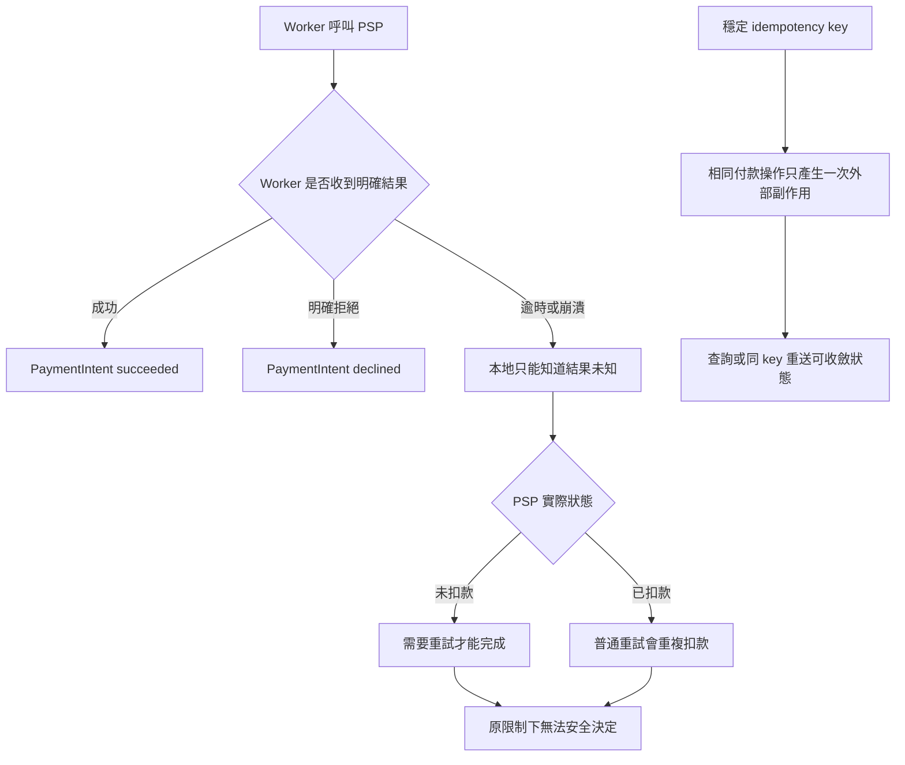

# 討論紀錄｜付款 Exactly Once、冪等與未知結果

## 文件資訊

- **討論日期**：2026-08-11、2026-08-19（Asia/Taipei）
- **紀錄日期**：2026-08-24（Asia/Taipei）
- **主題**：at-least-once 訊息、本地去重與外部 PSP 扣款之間的交易邊界，以及如何以冪等介面、狀態機和資料庫不變量避免重複扣款
- **參與者**：
  - scozirge
  - AI-Codex（GPT-5 系列，精確子版本未提供）
- **狀態**：本題已完成；已確認原始限制下三項要求不能同時保證

## 討論結果統整

系統以 PostgreSQL transactional outbox 發送 `payment_requested`，但訊息傳遞是 at-least-once，Payment Worker 呼叫的外部 PSP 又不支援 idempotency key、無法依 merchant request ID 查詢，而且 PSP 不參與本地資料庫交易。在這些限制下，即使 Worker 使用 `processed_events` 去除重複訊息，仍無法同時保證：同一訂單絕不重複扣款、PSP 扣款後訂單最終一定成為 `paid`，以及全程不依賴人工介入。

scozirge 正確找出兩種重複扣款風險：兩個 Worker 可能在競態下都看不到處理紀錄而呼叫 PSP；更根本的是 PSP 已扣款後 Worker 在本地交易完成前崩潰，重送訊息便可能再次扣款。他也正確指出，逾時後 Worker 無法分辨「請求未到達 PSP」與「PSP 已扣款但回應遺失」，所以重試與不重試都可能違反其中一項需求。

需要收緊的地方主要有四項：

1. at-least-once 表示訊息可能重送，不代表只要部署多個 Pod 就必然同時收到同一訊息；重疊處理通常發生在 ACK 遺失、處理逾時、visibility timeout 或 consumer rebalance 等情況。
2. 「PSP 冪等＋獨立查詢 API」是實務上完整的方案，但嚴格的最小修改可以只有一個具有持久冪等語意的 `charge(idempotency_key, ...)`：相同 key 重送時不再次扣款，並回傳第一次請求的既有結果。
3. 訂單已存在不代表付款已完成，所以不能只因 `order_id` 重複就忽略訊息；應依 PaymentIntent 的終態或非終態決定忽略、對帳或安全重試。
4. 唯一的訂單 ID 只能防止重複建立訂單，不能阻止兩個 Worker 同時對同一筆既有訂單執行 PSP 扣款。付款操作本身、冪等 key、PSP charge ID 及 Worker 處理權都需要各自的不變量。



## 起始問題

Order Service 使用 PostgreSQL，並在同一交易內建立訂單與 outbox 事件。Relay 將事件送到 at-least-once 訊息系統；Payment Worker 先檢查 `processed_events`，接著呼叫不支援冪等或結果查詢的 PSP，最後才在本地交易中寫入付款與處理紀錄。

問題要求找出重複扣款的故障時序、判斷三項需求能否同時成立、提出最小介面修改、設計付款狀態機，以及列出避免兩個 Worker 同時處理同一訂單所需的不變量。

## 重要前提

- Worker 可以在任何指令後崩潰並重新啟動。
- 網路逾時後，Worker 無法知道 PSP 是否已成功扣款。
- 原始 PSP `charge` 不接受 idempotency key，也無法依 merchant request ID 查詢結果。
- 本地資料庫、訊息系統與 PSP 之間不能使用分散式交易。
- transactional outbox 能確保本地訂單與待發事件一致，卻不能把 PSP 外部副作用納入同一原子交易。
- `processed_events` 只能記錄本地消費結果；若 PSP 已成功但本地紀錄尚未提交，它不會留下足以判斷外部結果的證據。
- 「exactly once」在本題指業務副作用只發生一次，而不只是訊息處理框架宣稱的一次投遞或一次提交。

## 不可能性的核心

最根本的故障時序如下：

```text
Worker A 收到 payment_requested
Worker A 查不到 processed_events
Worker A 呼叫 PSP
PSP 成功扣款
Worker A 在寫入 payments 與 processed_events 前崩潰
訊息重新投遞
Worker B 仍查不到本地成功紀錄
Worker B 再次呼叫 PSP
PSP 第二次扣款
```

即使先把本地狀態改成 `processing`，仍會產生無法辨識的情況：後來的 Worker 看見 `processing` 時，不知道前一個 Worker尚未呼叫 PSP，還是已經完成扣款但未及寫回。

在逾時後，本地可觀察狀態相同，PSP 真實狀態卻可能不同：

| PSP 真實狀態 | Worker 若重試 | Worker 若不重試 |
|---|---|---|
| 請求未到達，尚未扣款 | 正確，可能完成付款 | 付款可能永遠無法完成 |
| 已扣款，只有回應遺失 | 可能重複扣款 | 不會重扣，但訂單可能永遠不是 `paid` |

因此，在沒有 PSP 冪等能力、結果查詢或共同交易的前提下，任何自動決策都無法同時滿足安全性與活性。這不是多加一張本地資料表或多一個狀態便能解決的問題，而是外部副作用跨越交易邊界後缺少可恢復的操作身分。

## scozirge 的解答

### 已正確掌握

- 看出 `processed_events` 的 check-then-act 可能在兩個 Worker 間產生競態。
- 找出 PSP 已扣款、本地尚未提交便崩潰的關鍵故障窗口。
- 正確判定原始三項要求無法同時保證。
- 正確指出逾時後 retry 與不 retry 都可能錯誤。
- 提議 PSP 支援 idempotency key，並在實務上增加付款狀態查詢。
- 提出 `pending`、`processing`、`success`、`failed` 的初步狀態，以及背景程式處理長時間未完成的付款。
- 注意需要以唯一訂單 ID 防止重複建立訂單。

### 需要修正或補充

#### At-least-once 與同時處理

多個 Pod 不代表同一訊息一定被同步廣播。競態仍然可能發生，但較精確的原因是訊息在 ACK 遺失、處理逾時、consumer rebalance 等情況下被重新交付，而第一次處理可能尚未真正停止。

#### PSP 最小介面

scozirge 主張實務上同時需要冪等與狀態查詢，這是穩健方案；但若 PSP 對同一 idempotency key 的重送會回傳第一次操作的既有結果，那麼單一冪等 `charge` 介面在理論上已足以讓狀態收斂，不一定還需要獨立查詢端點。

若 PSP 只承諾相同 key 不再扣款，卻無法回傳既有結果，那麼獨立查詢 API 就會成為必要補充。無論採哪種設計，key 必須長期保存，且相同 key 搭配不同金額、幣別或支付資料時必須拒絕。

#### 重複訊息的處理

「資料庫已有相同 `order_id` 就不處理」過度簡化。訂單存在時，付款可能仍處於 `pending`、`in_flight` 或 `unknown`。若前次已在 PSP 成功但本地尚未收斂，直接忽略重送會讓訂單永遠無法變成 `paid`。

較正確的判斷是：

- `succeeded`：安全忽略重複訊息。
- `declined`：不再自動提交同一付款操作。
- `pending`：嘗試取得處理權。
- `in_flight`：由 lease 判斷是否仍由其他 Worker 處理。
- `unknown`：查詢 PSP 或以相同 key 安全重送。

#### 狀態與資料模型

訂單與付款操作不應完全共用一組狀態。一張訂單可能換卡重試、建立多次付款嘗試、退款或部分付款；因此應將 `Order` 與 `PaymentIntent` 分開。`processing` 也不應同時表示「正在呼叫」與「呼叫結果未知」，否則背景重試無法安全判斷。

#### 訂單 UID 的限制

兩個 Worker 處理的是同一筆已存在的訂單，因此都使用合法且相同的 `order_id`。訂單唯一性不會阻止它們各自呼叫 PSP。需要另外對付款操作建立唯一性，並以資料庫原子更新、row lock 或 lease 取得單一處理權；但即使本地完全串行化，Worker 在 PSP 成功後崩潰的問題仍只能由 PSP 冪等語意解決。

## 修正後的付款狀態機

### Order

- `pending_payment`
- `paid`
- `payment_failed`
- 視業務需要另有 `cancelled`、`refunded` 等狀態

### PaymentIntent

- `pending`：已建立但尚未取得處理權
- `in_flight`：某個 Worker 持有未過期 lease，正在呼叫 PSP
- `unknown`：請求逾時或 Worker 在不確定位置崩潰，PSP 結果未知
- `succeeded`：PSP 已確認成功
- `declined`：PSP 明確拒絕，屬終態
- `retryable_error`：PSP 明確表示暫時失敗，可稍後安全重試

### 建議流程

```text
建立訂單的本地交易:
    建立 Order(status = pending_payment)
    建立 PaymentIntent(status = pending, stable_idempotency_key)
    寫入 outbox payment_requested

Worker 收到事件:
    以條件更新或 lease 原子取得 PaymentIntent
    使用同一 stable_idempotency_key 呼叫 PSP

PSP 明確成功:
    PaymentIntent → succeeded
    Order → paid
    寫入 payment_succeeded outbox event

PSP 明確拒絕:
    PaymentIntent → declined
    若沒有其他付款路徑，Order → payment_failed

PSP 明確暫時錯誤:
    PaymentIntent → retryable_error
    依退避策略稍後重試

PSP 逾時或結果未知:
    PaymentIntent → unknown
    不建立新的付款操作，也不更換 idempotency key

背景對帳:
    查詢 PSP，或以相同 idempotency key 重送 charge
    依 PSP 既有結果將狀態收斂至 succeeded、declined 或可重試狀態
```

`in_flight` 過久只能表示 lease 需要重新取得，不能推論 PSP 沒有執行。新 Worker 接手後仍必須沿用同一 PaymentIntent 與 idempotency key。

## 資料庫限制與不變量

至少需要區分下列目的：

```text
orders:
    PRIMARY KEY (order_id)

payment_intents:
    PRIMARY KEY (payment_intent_id)
    UNIQUE (idempotency_key)
    UNIQUE (order_id, operation_type)
    UNIQUE (psp_charge_id)  // PSP 回傳後才有，可為 null

processed_events:
    PRIMARY KEY (consumer_name, event_id)
```

核心不變量包括：

- 同一個業務付款操作只對應一個穩定的 PaymentIntent。
- 同一 PaymentIntent 從建立到所有重試都使用相同 idempotency key。
- 相同訂單、相同付款操作類型不能建立兩個仍有效的 PaymentIntent；若業務允許換卡重試，需以 attempt 或 superseded 關係明確建模，而不能模糊地重用訂單狀態。
- `succeeded`、`declined` 等終態不得被普通重送倒退成非終態。
- `Order.paid` 必須能追溯至已確認成功的 PaymentIntent。
- 同一 PSP charge ID 不得關聯到兩筆本地付款。

Worker 取得執行權必須使用原子操作，例如：

- `SELECT ... FOR UPDATE SKIP LOCKED`；
- 帶狀態及版本條件的 compare-and-swap update；
- 具有 owner 與到期時間的 lease。

不可採用沒有唯一限制或原子更新保護的「先 SELECT、確認不存在，再 INSERT／UPDATE」流程。

## 共識與結論

- 原始限制下，三項要求不能同時保證。
- transactional outbox 解決本地狀態與訊息發布的一致性，不解決 PSP 外部扣款的原子性。
- `processed_events` 能去除已完成的本地訊息處理，不能修復「PSP 成功、本地未提交」的故障窗口。
- PSP 必須提供穩定付款操作 ID 的持久冪等語意；獨立查詢 API 是否為理論上的必要條件，取決於相同 key 重送能否取回既有結果。
- 訂單唯一性、事件去重、付款操作唯一性、Worker 處理權與 PSP 冪等各自解決不同問題，不能互相取代。
- scozirge 已正確掌握不可能性的核心；主要需要修正的是把訂單存在視為可以忽略重送，以及低估付款操作層級不變量的重要性。

## 完整問答過程

### AI-Codex（GPT-5 系列，精確子版本未提供）

### 分散式系統｜付款到底能不能做到 Exactly Once？

系統架構如下：

- Order Service 使用 PostgreSQL。
- 建立訂單時，在同一個資料庫交易中寫入：
  - `orders`
  - `outbox_events(payment_requested)`
- Relay 將 outbox 事件送到一個 **at-least-once** 訊息系統，因此事件可能重複。
- Payment Worker 收到事件後：

```text
如果 processed_events 已存在 event_id:
    直接結束

呼叫外部 PSP：charge(card, amount)

在本地資料庫交易中:
    寫入 payments
    寫入 processed_events(event_id)
```

故障模型：

- Worker 可以在任何指令後崩潰並重新啟動。
- 網路逾時後，無法知道 PSP 是否已成功扣款。
- PSP 的 `charge` API：
  - 不接受 idempotency key；
  - 無法用 merchant request ID 查詢結果。
- 你的資料庫、訊息系統與 PSP 之間不能使用分散式交易。
- 系統要求同時保證：
  1. 同一訂單絕不重複扣款；
  2. PSP 已扣款後，訂單最終一定會成為 `paid`；
  3. 不依賴人工介入。

請回答：

1. 給出一個即使使用 `processed_events`，仍會重複扣款的故障時序。
2. 在上述限制下，三項要求能否同時保證？請說明關鍵原因。
3. 最小需要修改 PSP 介面或系統假設的哪一部分，才能真正實現需求？
4. 修改後，請設計付款狀態機，至少處理：
   - 訊息重複；
   - Worker 崩潰；
   - PSP 回應成功；
   - PSP 明確拒絕；
   - PSP 請求逾時、結果未知；
   - 對帳與重試。
5. 資料庫至少需要哪些唯一性限制或不變量，才能避免兩個 Worker 同時處理同一訂單？

### scozirge

1. 因為at-least-once如果worker有多個pod 那可能就會同時收到多個呼叫 如果同時檢查資料庫發都沒這筆可能會同時呼叫PSP 另外 payment呼叫要在寫入訂單進度之後才修改 但即使這樣收到PSP成功後 如果服務掛掉會沒寫入db訂單成功 那又收到同個訂單也會重複扣款
2. 沒辦法 因為psp不接受idempotency跟查詢訂單狀態 所以worker沒有方法不知道到底PSP那端有沒有扣款成功 所以想要retry 或是 不retry都不對
3. 理論最小需要需要idempotency 至少重送時 PSP不會重複扣款 但實務上可能不知道要送幾次(因為無法查詢) 所以以我的標準來說最小修改要同時這樣優化要同時也能查詢訂單狀態
4. 流程:
	client送扣款需求->order服務收到->建立訂單 產生唯一的訂單ID 寫DB 並有狀態 pending(預設) processing(處理中 worker呼叫psp) success(psp回傳扣款成功) failed(psp回傳扣款失敗)
	服務有 order messageQueue orderWorker psp 
	訊息重複: 資料庫orderID重複就代表重複 不處理
	Worker崩潰: 訂單會再pending 或 processing 有背景程式去針對沒完成的訂單繼續處理
	PSP回應成功:  DB從processing改為success
	PSP拒絕: DB從processing改為failed
	PSP請求逾時或結果未知: 維持processing
	對帳與重試:processing過久就由背景程式繼續跟PSP查帳與重試
5. 訂單DB資料要有UID確保訂單不重複 這樣

### AI-Codex（GPT-5 系列，精確子版本未提供）

你的核心判斷是正確的：**在原始限制下不可能同時保證不重複扣款與最終完成付款**。主要需要修正的是第3點的「最小條件」、第4點的狀態設計，以及第5點僅靠訂單 UID 不足以避免並行扣款。

### 1. 故障時序判斷正確

你提出了兩種有效的失敗方式：

- 重複訊息被兩個 Worker 同時處理，兩者都在資料庫查不到 `processed_events`，因而同時呼叫 PSP。
- PSP 已扣款，但 Worker 在寫回資料庫前崩潰；訊息重送後再次扣款。

第二種是最根本的反例：

```text
Worker A 收到事件
→ PSP 扣款成功
→ Worker A 在本地 commit 前崩潰
→ 訊息重新投遞
→ Worker B 查不到成功紀錄
→ 再次呼叫 PSP
→ 重複扣款
```

補充一點：at-least-once 不一定代表同一訊息必然同時送給多個 Pod，但在 ack 遺失、visibility timeout、consumer rebalance 等情況下，確實可能發生重疊處理。

即使先在 DB 寫入 `processing`，也只會把問題改成：

> 看到 `processing` 時，前一個 Worker 究竟尚未呼叫 PSP，還是已經扣款但來不及寫回？

因此單靠本地狀態無法消除未知結果。

### 2. 不可能性的理由完全正確

逾時或崩潰後，本地可能看到完全相同的狀態，但 PSP 實際上有兩種可能：

- 請求根本沒有到達 PSP；
- PSP 已完成扣款，只是回應沒有到達 Worker。

Worker 無法區分兩者：

- 重試：第一種情況正確，第二種情況可能重複扣款。
- 不重試：第二種情況安全，第一種情況卻永遠無法完成。

這就是要求彼此衝突的地方。訊息系統即使提供自己的 exactly-once，也無法自動把保證延伸到不參與同一交易的 PSP。

### 3. 最小修改不一定需要兩個 API

你提出「idempotency＋狀態查詢」是實務上很完整的設計，但嚴格來說，最小必要能力可以只有一個：

```text
charge(stable_idempotency_key, payment_data)
```

但它必須同時保證：

- 同一 key 永遠只產生一次扣款；
- 重送相同 key 時，回傳第一次呼叫的既有結果；
- 相同 key 配上不同金額或付款資料時拒絕請求；
- key 的保存期限至少涵蓋整個付款與重試週期。

如果重送 `charge` 能取回原始結果，它本身也兼具查詢功能，不一定需要獨立的 `getPaymentStatus`。

但你的實務要求很合理：最好另外提供依 merchant payment ID 查詢的 API，方便對帳、人工查核與處理 PSP 內部異常。若 PSP 的重送只負責不重複扣款、卻不回傳先前結果，那麼查詢 API 就會變成必要條件。

### 4. 狀態機方向正確，但不應只用 Order 狀態

建議把訂單與付款操作拆開：

```text
Order
- pending
- paid
- payment_failed

PaymentIntent
- pending
- in_flight
- unknown
- succeeded
- declined
- retryable_error
```

較完整的流程：

```text
建立訂單交易:
    建立 Order
    建立 PaymentIntent，產生永久不變的 idempotency_key
    寫入 outbox event

Worker:
    以條件更新或 lease 原子取得 PaymentIntent
    使用同一 idempotency_key 呼叫 PSP

PSP 成功:
    PaymentIntent → succeeded
    Order → paid
    寫入 payment_succeeded outbox event

PSP 明確拒絕:
    PaymentIntent → declined
    Order → payment_failed

逾時或結果未知:
    PaymentIntent → unknown
    不直接判定失敗

背景對帳:
    查詢 PSP，或用同一 idempotency_key 重送
    succeeded → 完成訂單
    declined → 終止
    仍未知 → 延後重試
```

`processing` 過久不能直接重新建立一個付款請求；必須沿用同一個 PaymentIntent 和 idempotency key。

另外，明確的信用卡拒絕與技術錯誤最好分開：

- `declined`：PSP 明確表示不應再次提交相同付款。
- `retryable_error`：PSP 暫時不可用，可以安全重試。
- `unknown`：不知道 PSP 是否已執行，必須查詢或以相同 key 重送。

### 5. 訂單 UID 不足以阻止雙重處理

唯一的 `order_id` 只能阻止建立兩筆相同訂單，不能阻止兩個 Worker 同時對同一訂單執行外部副作用。

至少需要這些不變量：

```text
orders:
    PRIMARY KEY(order_id)

payment_intents:
    PRIMARY KEY(payment_intent_id)
    UNIQUE(idempotency_key)
    UNIQUE(order_id, operation_type)
    UNIQUE(psp_charge_id)  // PSP 成功後才有，可為 null

processed_events:
    PRIMARY KEY(consumer_name, event_id)
```

其中：

- `event_id` 解決同一訊息重複消費。
- `payment_intent_id` 解決同一付款操作重複建立。
- `idempotency_key` 解決 PSP 外部副作用重複執行。
- `order_id` 只負責訂單身分，不能取代前三者。

Worker 取得處理權也必須是原子操作，例如使用：

- `SELECT ... FOR UPDATE SKIP LOCKED`；
- 帶狀態及版本條件的 compare-and-swap update；
- 有到期時間的 lease。

不能使用「先 SELECT、確認沒有、再 UPDATE」的 check-then-act 流程。

總結來說，你的答案已經抓到這題最重要的不可能性。最需要收緊的是：

> **本地 deduplication 防止不了已離開本地交易邊界的重複副作用；真正的付款唯一性必須由 PSP 針對穩定的付款操作 ID 提供冪等語意。**

### scozirge

幫我把我錯誤的地方簡單解釋為什麼

### AI-Codex（GPT-5 系列，精確子版本未提供）

你的核心答案其實正確，主要有以下幾個地方需要修正：

1. **At-least-once 不代表多個 Pod 一定同時收到訊息**

   它只保證訊息可能被重送。多個 Worker 重疊處理通常發生在 ACK 遺失、處理逾時或 consumer rebalance 等情況。你的競態案例成立，但原因不是「只要有多個 Pod 就一定同時收到」。

2. **Idempotency key 本身可能已經足夠**

   你認為至少需要「冪等＋查詢 API」。這是實務上更完整的介面，但若 PSP 保證使用相同 key 重送時，會回傳第一次請求的既有結果，那麼重送本身也具有查詢效果，所以嚴格來說不一定需要獨立查詢 API。

3. **重複訊息不能只因 `order_id` 已存在就忽略**

   訂單存在不代表付款已完成。例如前一個 Worker 可能在 PSP 扣款後崩潰，訂單仍停在 `processing`。此時直接忽略重複訊息，訂單可能永遠無法變成 `paid`。

   正確做法是依付款狀態決定：

   - `succeeded`：忽略。
   - `declined`：通常停止。
   - `pending / unknown`：對帳或用相同 idempotency key 重試。

4. **逾時不應和一般 `processing` 混在一起**

   `processing` 可能表示請求正在執行；逾時則表示 PSP 是否扣款已經未知。最好另外設置 `unknown`，避免背景程式看到處理過久便直接建立新扣款。

5. **訂單狀態和付款狀態最好分開**

   一張訂單可能經歷多次付款嘗試、拒絕後換卡，甚至退款。因此只用訂單的 `pending / processing / success / failed`，會把「訂單生命週期」與「某次付款操作」混在一起。較合理的是分成 `Order` 與 `PaymentIntent`。

6. **唯一的訂單 UID 防不了兩個 Worker 同時扣款**

   兩個 Worker 處理的是同一筆既有訂單，所以它們使用相同 `order_id` 並不違反唯一限制。真正需要的是：

   - 每筆付款操作唯一；
   - idempotency key 唯一；
   - Worker 以原子更新或 lease 取得處理權；
   - PSP 也依相同 key 保證不重複扣款。

簡單總結：你的主要錯誤不是沒看出問題，而是把「訂單不重複」稍微等同成了「外部扣款不重複」。資料庫只能保護自己的資料，無法單獨保護已經送到 PSP 的外部副作用。
