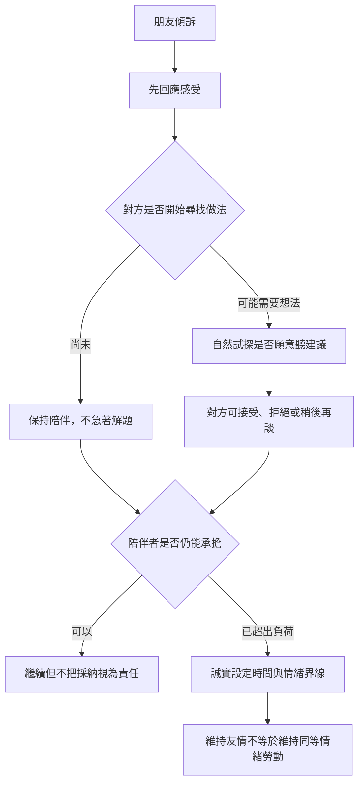

# 討論紀錄｜朋友陪伴、情緒界線與建議方式

## 文件資訊

- **日期**：2026-08-24（Asia/Taipei）
- **主題**：面對長期反覆傾訴的朋友，如何在維持友情、保護自身負荷、提供意見與單純陪伴之間設定界線
- **參與者**：
  - scozirge
  - AI-Codex（GPT-5 系列，精確子版本未提供）
- **狀態**：已形成階段性共識；何時需要把隱性的陪伴方式明說，仍取決於關係與情境

## 討論結果統整

情境中的朋友長期困在同一段痛苦關係，一年來頻繁在深夜傾訴，卻始終回到原本的關係與問題。當陪伴者表示無法再隨時承接時，朋友回應：「原來只有我狀態好的時候，你才願意當我的朋友。」

scozirge 認為，當陪伴已使自己疲憊並形成重大負擔，提出界線是在保護自己；若繼續勉強承擔，情況可能變得更糟。他希望朋友採納建議，但認為是否採納不應決定自己是否繼續陪伴。理想上，提供意見的人不把對方的選擇看得過重，而接受意見的人也需要以合適方式回應他人的投入。

對界線的表達，scozirge 區分兩種情況：若只是傾訴過於頻繁或當下沒有時間，可以說最近較忙，等有空再談；若已經對問題本身感到厭煩，則應直接把真實感受告訴對方。他也認為朋友用「只有我狀態好時你才願意當朋友」回應界線，具有以罪惡感迫使對方退讓的作用；他會生氣並明確指出這句話為何無助於朋友關係。

AI 起初建議將「提供方案」與「單純陪伴」分開，甚至可以請對方先說明自己需要哪一種支持。scozirge 隨後指出，這種說法放進真實朋友關係往往太刻意，多數朋友未必能接受；更重要的是，傾訴者自己可能也不知道當下究竟需要陪伴還是方案。因此，這項建議已修正為：**陪伴者可以在心中辨識兩種模式，但不必要求朋友明確分類；只有在同一種誤解反覆發生時，才自然地把差異說開。**

## 起始問題

一位親近朋友長期陷在同一段痛苦關係中，過去一年經常深夜傾訴。陪伴者每次都認真聆聽並提出建議，但朋友始終回到原本的問題。當陪伴者因疲憊而表示無法再隨時談論時，朋友指責他只願意在自己狀態好時當朋友。

問題包括：設定界線是自我保護還是拋棄朋友、朋友是否採納建議會不會影響陪伴責任、合理界線如何設定，以及如何回應帶有罪惡感壓力的話。

## 重要前提

- 朋友的困境已持續約一年，傾訴頻率高且常在深夜發生。
- 陪伴者過去確實長期投入時間與情緒，並非在朋友第一次求助時便拒絕。
- 朋友有權決定是否採納建議；陪伴者也有權決定自己能承擔的時間、頻率及內容。
- 「繼續當朋友」與「繼續提供相同程度的情緒承接」不是同一件事。
- 對方的話具有施加罪惡感的效果，但僅由一句話仍不能完全確定他是否有意識地操控；他也可能在害怕被拋棄時以攻擊方式表達受傷。

## scozirge 目前立場

### 界線是在負擔過重時保護自己

scozirge 認為，當陪伴已使自己疲憊並成為很大的負擔，就應適時提出界線；若持續壓抑，最後可能讓情況惡化。這並不表示朋友只能在狀態好時被接受，而是陪伴者本身也有可承擔的限度。

### 是否採納建議不應決定是否繼續陪伴

scozirge 會希望朋友採納建議，但理想上應把「我提供意見」與「對方最後怎麼做」分開。朋友有自己的決定權，提供意見的人不應把採納與否過度視為自己的成敗。

不過，這需要雙方共同維持：提供意見者不能用建議控制對方；接受意見者也應適當回應他人的投入，而不是把陪伴與方案視為可無限索取的資源。

### 界線應按真正原因表達

- 若主要問題只是頻率太高或當下沒有時間，可以表示最近較忙，之後有空再談。
- 若真正問題是已經對反覆談論同一件事感到厭煩，則應把這個感受表達給對方，而不是長期只用忙碌掩蓋。

### 不宜把朋友對話流程化

scozirge 不認為在一般朋友關係中，適合刻意詢問對方「你現在要的是陪伴還是方案」。這種分類可能顯得疏離，而且當事人自己也可能尚未辨識需求。較自然的方式是由陪伴者在心中知道兩種回應的差別，再依談話發展調整，而不是要求對方先選擇一種模式。

### 對罪惡感施壓應直接指出

scozirge 認為，「原來只有我狀態好的時候，你才願意當我的朋友」明顯具有 PUA 或罪惡感施壓的性質。他相信對方很可能知道這句話的作用；即使對方不知道，也會直接說明這句話為何對朋友關係沒有幫助。

## AI 模型的對照立場

AI-Codex（GPT-5 系列，精確子版本未提供）同意，提早設定界線除了保護自己，也可能保護關係。若勉強承擔到產生厭惡，最後可能突然爆發、疏遠或斷絕往來；誠實調整支持方式反而可能使友情延續。

AI 也同意，朋友不採納建議不應自動成為撤回友情的理由，但認為支持方式可以受到互動品質影響。如果對方反覆索取建議、拒絕所有方案，又要求陪伴者無限承受相同情緒，問題便不只是採納與否，而是是否尊重他人的投入與界線。

AI 起初提出較明確的模式區分，例如讓朋友說明目前想要被聽見還是想聽方案。**這項建議已修正。** 接受 scozirge 的反駁後，AI 認為直接分類容易使朋友關係流程化，也忽略當事人的需求可能尚未形成或會在談話中變化。

修正後的方式是：

1. 先自然回應感受，不急著解題。
2. 觀察對方是否開始詢問下一步或可能做法。
3. 有想法時，以「我有一個想法，你想聽聽看嗎？」等低壓方式試探，而非要求對方先定義需求。
4. 對方拒絕時，不立即理解成不尊重建議。
5. 只有當「一方總給方案、另一方總感到不被理解」反覆出現時，才自然談開兩種回應方式的差異。

對朋友帶有罪惡感的回應，AI 區分其作用與意圖：這句話確實會施加壓力，試圖讓陪伴者撤回界線；但在缺乏更多資訊時，不能完全確定它是有意識操控，還是出於被拋棄的恐懼。這項保留不會使該說法變得合理，只會影響後續應採說明、警告還是遠離。

## 共識與分歧

### 已形成的共識

- 當陪伴形成重大疲憊與負擔時，設定界線是合理的。
- 朋友有權不採納建議，陪伴者不應把對方的決定視為自己的責任。
- 不採納建議不等於不值得被陪伴，但也不代表陪伴形式與分量永遠不能調整。
- 繼續友情不等於必須維持同等頻率、時間與情緒投入。
- 陪伴與提供方案確實不同，但通常不需要把朋友對話變成明確的二選一流程。
- 當需求尚不清楚時，可以先回應情緒，再依談話自然轉入建議。
- 以罪惡感逼迫朋友取消界線，會傷害關係，應直接指出。

### 仍保留的差異或不確定性

- scozirge 較傾向把情境中的指責判定為對方明知其作用的 PUA；AI 則認為操控效果相當明顯，但僅靠一句話尚不足以完全確定主觀意圖。
- 「最近比較忙」可以是短期而自然的界線，但若真實原因是長期無法承接同一問題，何時應從緩衝說法改成直接表達，仍取決於關係與情境。

## 尚待討論

- 如果對方接受時間界線，卻仍持續以其他方式反覆要求情緒承接，何時應進一步拉開距離？
- 若朋友正處於自傷、暴力或其他立即危險中，普通友情界線與緊急介入責任應如何區分？
- 當陪伴者已經厭煩時，直接表達到什麼程度既誠實又不造成不必要的羞辱？

## 完整問答過程

### AI-Codex（GPT-5 系列，精確子版本未提供）

### 人際與人生思考｜陪伴的界線在哪裡？

你有一位很親近的朋友，長期陷在同一段痛苦的關係裡。過去一年，他經常深夜找你傾訴；你每次都認真陪伴、提出建議，但他始終回到原本的關係與問題。

你逐漸感到疲憊，開始不想接電話。當你表示自己無法再像以前一樣隨時陪他談時，他回答：

> 「原來只有我狀態好的時候，你才願意當我的朋友。」

請思考：

1. 你設定界線，算是在保護自己，還是在朋友最需要時拋下他？
2. 朋友是否採納建議，會不會影響你繼續陪伴他的責任？
3. 如果你願意繼續當朋友，但不願再無限制承接同一問題，界線可以怎麼訂才算合理？
4. 你會怎麼回覆他上面那句話？

最核心的問題是：

> **真正的陪伴，是不設限地留下，還是誠實說明自己能承擔到哪裡？**

### scozirge

1. 保護自己 因為當自己也感到疲憊變成大的負擔時就要適時提出 不然會更糟
2. 會希望採納 但不應該影響繼續陪伴 理想是心理上能做到建議規建議 但他怎麼做是他的決定 不會影響我的心情(但這需要雙方努力 提供意見的人需要 把對方是否採納看得不要太重 對方也要用對的方式來回饋提議)
3. 如果只是單純太頻繁不想花太多時間 可以簡單說最近比較忙 等有空再來聊這個問題 但如果是對問題本身感到厭煩 那就表達給對方聽
4. 我會生氣 但會講出來 因為這句話明顯在pua 我相信他知道 但他如果不知道 我會講為什麼這句話本身就對朋友關係沒幫助

### AI-Codex（GPT-5 系列，精確子版本未提供）

你的立場可以整理成：

> 陪伴不等於無限承擔。朋友可以不採納建議，但也必須尊重陪伴者的時間、情緒容量與界線。

我大致同意，不過有三點值得再收緊。

1. **設界線是在保護關係，不只是保護自己**

如果勉強陪伴到產生厭惡，最後可能突然爆發、疏遠，甚至直接斷絕關係。提早說明界線，反而讓友情有機會維持。

2. **不採納建議，不應成為撤回友情的理由；但可能改變陪伴方式**

朋友有權不接受建議，你也不必把他的決定當成自己的成敗。不過，如果他反覆要求建議、拒絕所有方案，又要求你持續承受相同情緒，問題便不只是「有沒有採納」，而是他是否尊重你的投入。

可以改成：

> 「你不一定要照我的建議做，但如果你目前只需要有人聽，可以先告訴我；我也會說自己現在有沒有力氣聽。」

這能把「提供方案」和「單純陪伴」分開。

3. **如果真正原因不是忙，最好不要長期用『最近比較忙』代替界線**

暫時想緩衝時這樣說沒有問題；但若真正原因是你已無法再承接同一問題，持續用忙碌推遲，對方可能以為只要等你有空，一切就會恢復原狀。比較誠實的說法是：

> 「我仍然在乎你，但這個問題長期反覆談，已經超過我現在能承擔的程度。我可以偶爾陪你談，但沒辦法再隨時接住，也希望你尋找其他支持。」

至於「原來只有我狀態好的時候，你才願意當我的朋友」，這句話確實具有**施加罪惡感、迫使你撤回界線**的作用。不過，「它具有操控效果」不等於我們已能確定對方有意識地 PUA；他也可能是在害怕被拋棄時，以攻擊方式表達受傷。這不能替他的說法開脫，但會影響你要採取說明、警告，還是遠離。

你可以直接回：

> 「你這樣說讓我覺得，我只要不能隨時承接你的情緒，就會被說成不是朋友。我仍然在乎你，也願意陪伴你，但我有權說自己現在承擔不了。你可以因為我的界線感到失望，但不能用罪惡感逼我取消它。」

我認為你這次回答最成熟的地方，是沒有把「繼續當朋友」和「繼續提供同樣程度的情緒勞動」視為同一件事。朋友關係可以繼續，但支持的形式與分量必須允許調整。

### scozirge

「提供方案」和「單純陪伴」分開 我覺得2這個提議不太適合實用在真正的朋友關係 因為這樣講出來大部分朋友都不能接受 實際上他們可能內心也不知道 只是想單純陪伴 還是 需要方案的界線 我覺得還是自己知道 但不要刻意跟對方說會更好

### AI-Codex（GPT-5 系列，精確子版本未提供）

你這個修正成立。我前面的說法太像把朋友關係「流程化」了：

> 「請選擇：你要情緒支持，還是問題解決？」

真正的朋友這樣問，確實可能顯得疏離，像諮商、客服或溝通教材，而不像自然交流。而且你指出更重要的一點：**當事人自己可能也不知道需要什麼**。他可能一開始只是想傾訴，談著談著才願意思考方案；也可能口頭上問意見，實際上暫時沒有能力接受。

比較自然的方式是由陪伴者在心裡保持區分，但不必明講分類：

1. 先回應感受，不急著解題：

   > 「這樣反覆發生，真的會很累。」

2. 觀察對方是否開始問「那我能怎麼辦」。

3. 有想法時先輕微試探：

   > 「我有想到一個可能的做法，你想聽聽看嗎？」

4. 對方抗拒時，不必立刻理解成不尊重建議：

   > 「沒關係，你可以先不用決定。」

這不是要求朋友先辨認自己的需求，而是讓談話自然地在陪伴與建議之間移動。

不過，完全不說也有一個風險：如果一方長期提供方案，另一方每次都反感，雙方可能各自以為對方不尊重自己。因此平常不必刻意分類，但當相同摩擦反覆出現時，還是可以用較自然的方式談：

> 「我發現我常常一聽就想幫你找方法，但那可能不是你當下需要的。如果我又太快給建議，你可以直接提醒我。」

所以更準確的原則是：

> **自己心中要分得出陪伴與建議，但不必要求朋友把需求明確分類；只有當誤解反覆發生時，才把這層差異說開。**

這比我原本直接問「你要陪伴還是方案」更符合真實朋友關係。
